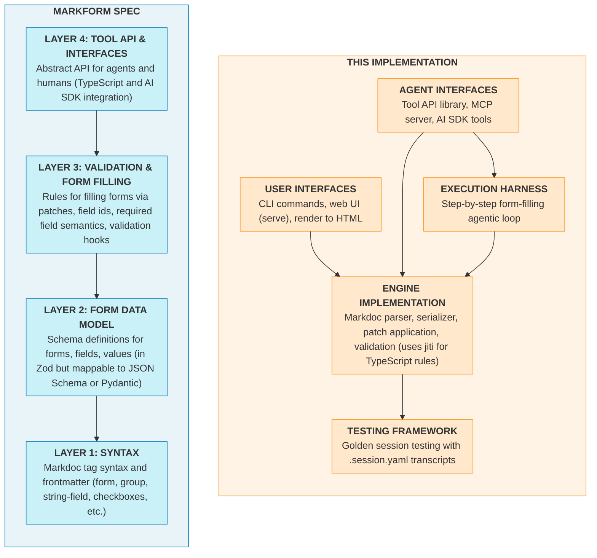

# Markform

**Markform** turns Markdown documents into executable specifications for structured data
collection.
Define fields, validation rules, and instructions in a single `.form.md` file
that is readable by humans, parseable by machines, and fillable by LLM agents.

The core idea: **a form combines structure, unstructured context, and memory in a simple
text document**. Users can give inputs via UIs or CLI. Agents can fill fields
incrementally via tools or APIs.
Validation catches errors early and humans can review or intervene at any point.
The entire workflow is visible in a token-friendly text file you can read, diff, and
version control.

Syntax is [Markdoc](https://github.com/markdoc/markdoc), which is Markdown extended with
`` annotations, so LLMs are already quite good at writing Markform docs.

## Why?

Many agent workflow frameworks emphasize *prompts* and the *flow* of information (the
*how*) over the desired *structure* of the results (the *what*). Markform lets you build
agent workflows by structuring and validating *what* you want (the structure of
information, validations, and reviews encoded in a form) instead of *how* to run a
workflow as code (via explicit workflows or just an unstructured swarm of agents).

For centuries, humans have used paper forms to systematize and manage processes.
A well-designed form with instructions, field definitions, and validations is a concise
way to share context: background knowledge, goals, process rules, and memories.
I don’t think AI changes this essential aspect of knowledge work.
It’s time to bring bureaucracy to the agents.

There’s one more key benefit to this approach: LLMs are good at writing forms!
Because the syntax is just Markdown with Jinja-style tags, agents can convert an
informal Markdown doc describing a process to a precise Markform process easily.

(For more, see [the FAQ](#faq).)

## Quick Start

```bash
# Try filling in one of a few example forms without installing.
# First set OPENAI_API_KEY or ANTHROPIC_API_KEY in environment or .env file
# to try the research examples.
npx markform examples

# Read the docs
npx markform  # CLI help
npx markform readme   # This file
npx markform docs  # Quick start for humans or agents to write Markforms
npx markform spec  # Read the full spec
```

This lets you walk through a form interactively from the CLI, with the option to have an
agent fill in parts of the form.

## Installation

Requires Node.js 20+.

```bash
# As a global CLI
npm install -g markform

# Or as a project dependency
npm install markform
```

## Example: Research a Movie

### Form Definition

A `.form.md` file is simply a Markdoc file.
It combines YAML frontmatter with Markdoc-tagged content:

```markdown
---
markform:
  spec: MF/0.1
  title: Movie Research (Minimal)
  description: Quick movie lookup with just the essentials (title, year, ratings, summary).
  roles:
    - user
    - agent
  role_instructions:
    user: "Enter the movie title."
    agent: |
      Quickly identify the movie and fill in basic info from IMDB.
      This is a minimal lookup - just get the core facts.
---


## Movie Research Example



What movie do you want to research? \[*This field is filled in by the user (`role="user"`).*\]


Enter the movie title (add year or details for disambiguation).



## About the Movie



**Title:**


Official title, including subtitle if any.

**Release year:**



**IMDB:**



**MPAA rating:**


- [ ] G 
- [ ] PG 
- [ ] PG-13 
- [ ] R 
- [ ] NC-17 
- [ ] NR/Unrated 


**IMDB rating:**


IMDB user rating (1.0-10.0 scale).

**Summary:**


Brief plot summary in 1-2 sentences, no spoilers.




```

### Form Report Output

Run the `npx markform examples` and select the `Movie Research (Minimal)` example and
view the report:

```markdown
# Movie Research (Minimal)

## Movie Identification

Movie:
shawshank redemption

## About the Movie

Full Title:
The Shawshank Redemption

Release Year:
1994

IMDB URL:
https://www.imdb.com/title/tt0111161/

MPAA Rating:
R

IMDB Rating:
9.3

One-Line Summary:
Convicted banker Andy Dufresne is sent to Shawshank State Penitentiary, where he forms an unexpected friendship with inmate Red while holding onto hope and striving to maintain his dignity in a corrupt prison system.
```

### More Example Forms

The package includes example forms.
View them with `markform examples --list` or try these interactively:

- [`simple.form.md`](https://github.com/jlevy/markform/blob/main/packages/markform/examples/simple/simple.form.md)
  \- Basic form demonstrating all field kinds.

- [`movie-research-minimal.form.md`](https://github.com/jlevy/markform/blob/main/packages/markform/examples/movie-research/movie-research-minimal.form.md)
  \- The quick example above.

- [`movie-research-basic.form.md`](https://github.com/jlevy/markform/blob/main/packages/markform/examples/movie-research/movie-research-basic.form.md)
  \- Standard movie research with IMDB, Rotten Tomatoes, Metacritic.

- [`movie-research-deep.form.md`](https://github.com/jlevy/markform/blob/main/packages/markform/examples/movie-research/movie-research-deep.form.md)
  \- Comprehensive movie analysis with streaming, box office, analysis.

- [`earnings-analysis.form.md`](https://github.com/jlevy/markform/blob/main/packages/markform/examples/earnings-analysis/earnings-analysis.form.md)
  \- Financial analysis form.

## CLI Commands

### Explore Examples

```bash
# Interactive: select an example, fill it, optionally run agent
markform examples

# List available examples
markform examples --list

# Start with a specific example
markform examples --name political-research
```

### Inspect Forms

```bash
# View form structure, progress, and validation issues
markform inspect my-form.form.md

# Output as JSON
markform inspect my-form.form.md --format=json
```

### Fill Forms

```bash
# Interactive mode: fill user-role fields via prompts
markform fill my-form.form.md --interactive

# Agent mode: use an LLM to fill agent-role fields
markform fill my-form.form.md --model=anthropic/claude-sonnet-4-5

# Mock agent for testing (uses pre-filled form as source)
markform fill my-form.form.md --mock --mock-source filled.form.md
```

### Export and Transform

```bash
# Export as readable markdown (strips Markdoc tags)
markform export my-form.form.md --format=markdown

# Export values as JSON
markform export my-form.form.md --format=json

# Export values as YAML
markform export my-form.form.md --format=yaml

# Dump just the current values
markform dump my-form.form.md
```

### Apply Patches

```bash
# Apply a JSON patch to update field values
markform apply my-form.form.md --patch '[{"op":"set","fieldId":"name","value":"Alice"}]'
```

### Web Interface

```bash
# Serve a form as a web page for browsing
markform serve my-form.form.md
```

### Documentation Commands

```bash
# Quick reference for writing forms (agent-friendly)
markform docs

# Full specification
markform spec

# TypeScript and AI SDK API documentation
markform apis

# This README
markform readme

# See supported AI providers and example models
markform models

# See all commands
markform --help
```

## Supported Providers

Standard LLMs can be used to fill in forms or create research reports from form
templates. The package currently has support for these models built in, and enables web
search tools for them if possible.

| Provider | Env Variable | Example Models |
| --- | --- | --- |
| openai | `OPENAI_API_KEY` | gpt-5-mini, gpt-5.1, gpt-5.2 |
| anthropic | `ANTHROPIC_API_KEY` | claude-sonnet-4-5, claude-opus-4-5 |
| google | `GOOGLE_API_KEY` | gemini-2.5-pro, gemini-2.5-flash |
| xai | `XAI_API_KEY` | grok-4, grok-4-fast |
| deepseek | `DEEPSEEK_API_KEY` | deepseek-chat, deepseek-reasoner |

Set the appropriate environment variable for your provider before running `markform
fill`. See
[`src/settings.ts`](https://github.com/jlevy/markform/blob/main/packages/markform/src/settings.ts)
for the full list of models.

## Architecture



## Programmatic Usage

Markform exports a parsing engine and AI SDK integration for use in your own
applications.

### Basic Parsing

```typescript
import { parseForm, serializeForm } from "markform";

// Parse a .form.md file
const form = parseForm(markdownContent);

// Access schema and values
console.log(form.schema.title);
console.log(form.values);

// Serialize back to markdown
const output = serializeForm(form);
```

### AI SDK Integration

Markform provides tools compatible with the [Vercel AI SDK](https://sdk.vercel.ai/):

```typescript
import { parseForm } from "markform";
import { createMarkformTools, MarkformSessionStore } from "markform/ai-sdk";
import { generateText } from "ai";
import { anthropic } from "@ai-sdk/anthropic";

const form = parseForm(markdownContent);
const store = new MarkformSessionStore(form);
const tools = createMarkformTools({ sessionStore: store });

const result = await generateText({
  model: anthropic("claude-sonnet-4-5-20250929"),
  prompt: "Fill out this form with appropriate values...",
  tools,
  maxSteps: 10,
});
```

**Available tools:**

| Tool | Description |
| --- | --- |
| `markform_inspect` | Get current form state, issues, progress |
| `markform_apply` | Apply patches to update field values |
| `markform_export` | Export schema and values as JSON |
| `markform_get_markdown` | Get canonical Markdown representation |

## FAQ

### Can you say more why this is a good idea?

Yes! I’ve come to believe forms are a missing piece of the workflow problem with agents.
For deep research or complex multi-step workflows, key pieces need to be *precisely
controlled*, *domain-specific*, and *always improving*. You need precise documentation
on the key intermediate states and final output from an AI pipeline.

But you don’t want structure in a GUI (not token friendly) or code (hard to update) or
dependent on the whims of a thinking model (changes all the time).
Forms define these pieces and are easy to edit.
All other choices can be left to the agents themselves, with the structure and
validations enforced by the form-filling tools the agents use.

### Is this mature?

No! I just wrote it.
The spec is a draft.
But it’s been useful for me already.

### Was it Vibe Coded?

It’s all written by LLMs but using a strongly spec-driven process, using rules from
[Speculate](https://github.com/jlevy/speculate).
See [the spec](docs/markform-spec.md) and the architecture docs and specs in
[docs/](docs/).

### What are the goals of Markform?

- **Markform should express complex structure and validation rules for outputs:** Fields
  can be arbitrary types like checkboxes, strings, dates, numbers, URLs, and lists.
  Validation rules can be simple (min and max value, regexes), arbitrary code, or LLM
  calls.

- **Markform is programmatically editable:** Field state should be updated via APIs, by
  apps, or by agent tools.

- **Markform is readable by humans and agents:** Both templates and field values of a
  form should have a clear text format (not a binary or obscure XML format only readable
  by certain applications).

### How do agents fill in forms?

The data model and editing API let agents fill in forms.
This enables powerful AI workflows that assemble information in a defined structure:

- **Form content, structure, and field values are in a single text file** for better
  context engineering.
  This is a major advantage for LLM agents and for humans reviewing their work.

- **Incremental filling** means an agent or a human can take many iterations, filling
  and correcting a form until it is complete and satisfies the validation rules.

- **Multiple interfaces for humans or agents** can work with the same forms.
  You can interact with a form via a CLI, a programmatic API, from Vercel AI SDK or in
  an MCP server used by an agent, or in web form UIs for humans.

- **Flexible validation** at multiple scopes (field/group/form), including declarative
  constraints and external hooks to arbitrary code (currently TypeScript) or LLM-based
  validation instructions.

- An **agent execution harness** for step-by-step form filling, enabling deep research
  agents that assemble validated output in a structured format.

### Does anything like this already exist?

Not that I have seen.
The closest alternatives are:

- Plain Markdown docs can be used as templates and filled in by agents.
  These are more expressive, but it is hard to edit them programmatically or use LLMs to
  update them reliably.

- Agent to-do lists are part of many chat or coding interfaces and are programmatically
  edited by agents. But these are limited to simple checklists, not forms with other
  fields.

- Numerous tools like Typeform, Google Forms, PDF forms, and Docusign offer
  human-friendly UI. But these do not have a human-friendly text format for use by
  agents as well as humans.

| Approach | Has GUI | Human-readable source format | Agent-editable | APIs and validation rules |
| --- | :---: | :---: | :---: | :---: |
| Plain Markdown | ☑️ existing tools | ✅ | ⚠️ fragile | ❌ |
| JSON with schema | ⚠️ in some apps | ⚠️ um it’s JSON | ✅ | ✅ |
| SaaS tools (Typeform, Docusign, PDF forms) | ✅ | ⚠️ rarely | ⚠️ if they add it | ⚠️ if they add it |
| Excel/Google Sheets | ✅ | ❌ .csv (poor) or .xlsx (worse) | ⚠️ with tools | ✅ with some coding |
| **Markform** | ☑️ existing tools | ✅ | ✅ with this package | ✅ with this package |

### What are example use cases?

- Deep research tools where agents need to follow codified processes to assemble
  information

- Practical task execution plans with checklists and assembled answers and notes

- Analysis processes, like assembling insights from unstructured sources in structured
  form

- Multi-agent and agent-human workflows, where humans and/or agents fill in different
  parts of a form, or where humans or agents review each other’s work in structured ways

- A clean and readable text format for web UIs that involve filling in forms, supporting
  strings, lists, numbers, checkboxes, URLs, and other fields

### Why use Markdoc as a base format?

Markdoc extends Markdown with structured tags, allowing AST parsing and programmatic
manipulation while preserving human and LLM readability.
See Stripe’s [Markdoc overview][markdoc-overview] and [blog post][stripe-markdoc] for
more on the philosophy behind “docs-as-data” that Markform extends to “forms-as-data.”
We could use XML tags, but Markdoc has some niceties like tagging Markdown AST nodes
(``) so I decided to go with this.

### Is there a VSCode plugin for Markform or Markdoc?

For quick syntax highlighting of `` syntax, install
[Better Jinja](https://marketplace.visualstudio.com/items?itemName=samuelcolvin.jinjahtml)
and associate `.form.md` files with the `jinja-md` language mode in your VS Code
settings:

```json
"files.associations": {
  "*.form.md": "jinja-md"
}
```

Or see [markdoc/language-server](https://github.com/markdoc/language-server).

## Documentation

- **[Quick
  Reference](https://github.com/jlevy/markform/blob/main/docs/markform-reference.md)**
  (or run `markform docs`) - Concise syntax reference (agent-friendly)

- **[Markform Spec](https://github.com/jlevy/markform/blob/main/docs/markform-spec.md)**
  (or run `markform spec`) - Complete syntax and semantics

- **[API
  Documentation](https://github.com/jlevy/markform/blob/main/docs/markform-apis.md)**
  (or run `markform apis`) - TypeScript and AI SDK APIs

- **[Design
  Doc](https://github.com/jlevy/markform/blob/main/docs/project/architecture/current/arch-markform-design.md)**
  \- Technical design and roadmap

- **[Development](https://github.com/jlevy/markform/blob/main/docs/development.md)** -
  Build, test, and contribute

## License

AGPL-3.0-or-later. [Contact me](https://github.com/jlevy) for additional licensing
options.

[markdoc-overview]: https://markdoc.dev/docs/overview
[stripe-markdoc]: https://stripe.com/blog/markdoc
