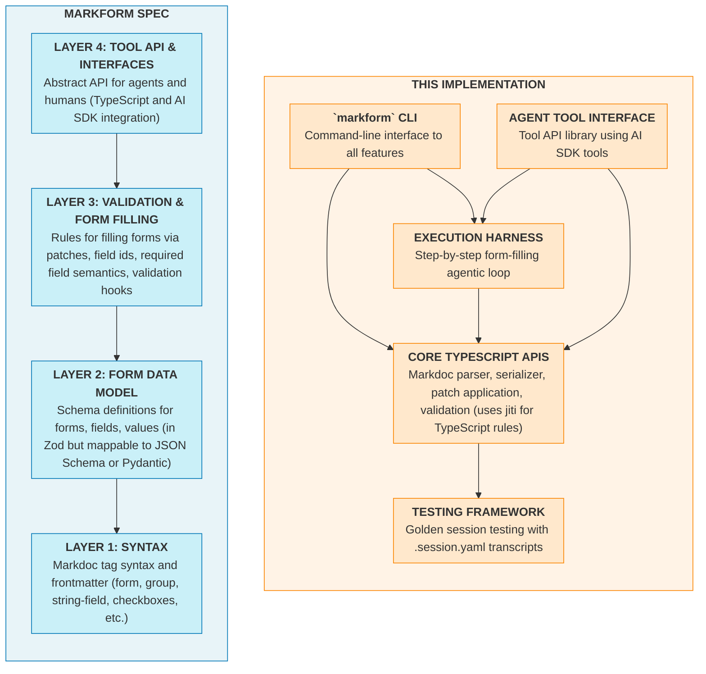

# Markform

[](https://github.com/jlevy/markform/actions/workflows/ci.yml)
[](https://github.com/jlevy/markform)

**Markform** is a text format for defining structured forms that humans can read,
machines can parse, and agents can fill via tool calls.

Define instructions, fields, and validation rules in a single `.form.md` file.
Agents fill forms incrementally via patches.
Fields are validated, so errors are caught early and can be corrected.
Humans can review or intervene at any point.

**Why forms?** For deep research or complex AI tasks, you need more than just prompts or
flow: you need *structure*, which is precise control over agent output at every stage of
a workflow. A well-designed form combines instructions, structured data, and validations
in one place.

**How it works:**

- A Markform document exposes a programmatic interface: users fill fields via CLI or web
  UI, agents fill via tool calls ([Vercel AI SDK](https://github.com/vercel/ai)
  integration included).

- Changes are explicit patch operations (`{ "op": "set_string", "fieldId": "name",
  "value": "Alice" }`) validated against a schema specified in the form.
  The agent sees validation errors and can self-correct.

- The format extends Markdown with a
  [precise specification](https://github.com/jlevy/markform/blob/main/docs/markform-spec.md).
  Export Markform syntax to JSON, YAML, JSON Schema, or plain Markdown reports.

Markform syntax is a good source format: token-efficient text you can read, diff, and
version control.
It is built with [Markdoc](https://github.com/markdoc/markdoc), which is
a Markdown extension from Stripe with Jinja-style `` annotations.

## Why Do Agents Need Forms?

For centuries, humans have used paper forms and
[checklists](https://en.wikipedia.org/wiki/The_Checklist_Manifesto) to systematize
complex processes. A form with instructions, field definitions, and validations is a
concise way to share context: goals, background knowledge, process rules, and state
(memory). I don’t think AI changes this essential aspect of knowledge work.

Most agent frameworks focus on *prompts* and *flow* (the how) over the *structure* of
results (the what).
But for deep research or other multi-step workflows, you need precise
control over intermediate states and final output.
You don’t want that structure in a GUI (not token-friendly), in code (hard to update),
or dependent on model whims (changes unpredictably with model updates).

Forms solve this. Forms codify operational excellence.
They’re easy to read, easy to edit, and enforce standards.
Because LLMs handle Markdown and Jinja-style tags well, agents can also help create and
improve the forms themselves—closing the meta-loop.

It’s time to bring bureaucracy to the agents!
See [the FAQ](#faq) for more on the design.

## Quick Start

```bash
# Copy example forms to ./forms/ and run one interactively.
# Set OPENAI_API_KEY or ANTHROPIC_API_KEY (or put in .env) for research examples
npx markform@latest examples

# Read the docs (tell your agents to run these; they are agent-friendly!)
npx markform  # CLI help
npx markform readme   # This file
npx markform docs  # Quick reference for writing Markforms
npx markform spec  # Read the full spec
```

The `markform examples` command copies some sample forms to `./forms` and prompts you to
fill in a form interactively and then optionally have an agent complete it.
Pick `movie-research-demo.form.md` for a quick example.

## Installation

Requires Node.js 20+.

```bash
# As a global CLI
npm install -g markform

# Or as a project dependency
npm install markform
```

## Example: Research a Movie

### Form Definition

A `.form.md` file is simply a Markdoc file.
It combines YAML frontmatter with Markdoc-tagged content.

The text can be any Markdown.
The tags define things like fields:

```jinja



- [ ] G 
- [ ] PG 
- [ ] PG-13 
- [ ] R 
- [ ] NC-17 
- [ ] NR/Unrated 

```

Fields have types defined by the attributes.
Values are filled in incrementally, just like any form.
Once filled in, values appear directly inside the tags, in Markdown format:

```jinja

The Shawshank Redemption



- [ ] G 
- [ ] PG 
- [ ] PG-13 
- [X] R 
- [ ] NC-17 
- [ ] NR/Unrated 

```

Note fields can have a `role="user"` to indicate they are filled interactively by the
user, or a `role="agent"` to indicate an agent should fill them in.

There are also tags for user or agent instructions per field or at form level and
grouping of forms.

Checkboxes and tables as values are supported!
Checkboxes can be single-select or multi-select.

Here’s a full example:

<details>

<summary>Markform for Movie Research Demo (click to expand)</summary>

```jinja
---
markform:
  spec: MF/0.1
  title: Movie Research Demo
  description: Movie lookup with ratings from IMDB and Rotten Tomatoes.
  run_mode: research
  roles:
    - user
    - agent
  role_instructions:
    user: "Enter the movie title."
    agent: |
      Identify the movie with web searches and use imdb.com and rottentomatoes.com to fill in the ratings.
---



## What movie do you want to research?


Enter the movie title (add year or details for disambiguation).





## Movie Ratings

Here are the ratings for the movie:


- [ ] G 
- [ ] PG 
- [ ] PG-13 
- [ ] R 
- [ ] NC-17 
- [ ] NR/Unrated 



| Source | Score | Votes |
|--------|-------|-------|



Fill in scores and vote counts from each source:
- IMDB: Rating (1.0-10.0 scale), vote count
- RT Critics: Tomatometer (0-100%), review count
- RT Audience: Audience Score (0-100%), rating count




```

</details>

### Form Report Output

Run `npx markform examples` to copy examples, then `npx markform run` and select `Movie
Research Demo` to fill it.

A form can be exported

- as the filled form (Markform format, just like the input)

- as a report (plain Markdown)

- as values (YAML or JSON)

- as a JSON schema (just the structure)

The report output (using `gpt-5-mini` to fill it in) looks like:

```markdown
Movie:
The Shawshank Redemption

## About the Movie

MPAA Rating:
R

Ratings:
| Source | Score | Votes |
| --- | --- | --- |
| IMDB | 9.3 | 3100000 |
| RT Critics | 89 | 146 |
| RT Audience | 98 | 250000 |
```

Here is the schema and YAML values for the form above.

<details> <summary>Filled Markform (click to expand)</summary>

````jinja





```value
The Shawshank Redemption
```



Enter the movie title (add year or details for disambiguation).







- [ ] G 
- [ ] PG 
- [ ] PG-13 
- [x] R 
- [ ] NC-17 
- [ ] NR/Unrated 



| Source | Score | Votes |
| --- | --- | --- |
| IMDB | 9.3 | 3100000 |
| RT Critics | 89 | 146 |
| RT Audience | 98 | 250000 |



Fill in scores and vote counts from each source:IMDB: Rating (1.0-10.0 scale), vote countRT Critics: Tomatometer (0-100%), review countRT Audience: Audience Score (0-100%), rating count





````

</details>

<details> <summary>YAML Export (click to expand)</summary>

```yaml
values:
  movie:
    state: answered
    value: The Shawshank Redemption
  mpaa_rating:
    state: answered
    value: r
  ratings_table:
    state: answered
    value:
      - source: IMDB
        score: 9.3
        votes: 3100000
      - source: RT Critics
        score: 89
        votes: 146
      - source: RT Audience
        score: 98
        votes: 250000
```

</details>

<details> <summary>JSON Schema (click to expand)</summary>

```json
{
  "$schema": "https://json-schema.org/draft/2020-12/schema",
  "$id": "movie_research_demo",
  "type": "object",
  "properties": {
    "movie": {
      "type": "string",
      "title": "Movie",
      "minLength": 1,
      "maxLength": 300
    },
    "mpaa_rating": {
      "type": "string",
      "enum": ["g", "pg", "pg_13", "r", "nc_17", "nr"],
      "title": "MPAA Rating"
    },
    "ratings_table": {
      "type": "array",
      "items": {
        "type": "object",
        "properties": {
          "source": { "title": "Source", "type": "string" },
          "score": { "title": "Score", "type": "number" },
          "votes": { "title": "Votes", "type": "number" }
        }
      },
      "title": "Ratings",
      "minItems": 0,
      "maxItems": 3
    }
  },
  "required": ["movie", "ratings_table"]
}
```

</details>

### More Example Forms

The package includes example forms.
View them with `markform examples --list`, copy with `markform examples`, and run with
`markform run`:

- [`simple.form.md`](https://github.com/jlevy/markform/blob/main/packages/markform/examples/simple/simple.form.md)
  \- Basic form demonstrating all field kinds.

- [`movie-research-demo.form.md`](https://github.com/jlevy/markform/blob/main/packages/markform/examples/movie-research/movie-research-demo.form.md)
  \- The quick example above.

- [`movie-deep-research.form.md`](https://github.com/jlevy/markform/blob/main/packages/markform/examples/movie-research/movie-deep-research.form.md)
  \- Comprehensive movie analysis with streaming, box office, technical specs.

- [`earnings-analysis.form.md`](https://github.com/jlevy/markform/blob/main/packages/markform/examples/earnings-analysis/earnings-analysis.form.md)
  \- Financial analysis form.
## Architecture

This repo has a specification and an implementation.
The implementation is a TypeScript API with Vercel AI SDK integration, and a CLI
interface.



## CLI Commands

### Copy and Run Examples

```bash
# Copy all bundled examples to ./forms/
markform examples

# List available examples
markform examples --list

# Copy a specific example
markform examples --name movie-research-demo
```

### Browse and Run Forms

```bash
# Browse forms in ./forms/ and run one interactively
markform run

# Run a specific form directly
markform run forms/movie-research-demo.form.md
```

### Check Form Status

```bash
# Show fill progress with per-role breakdown
markform status my-form.form.md
```

### Inspect Forms

```bash
# View form structure, progress, and validation issues
markform inspect my-form.form.md

# Output as JSON
markform inspect my-form.form.md --format=json
```

### Fill Forms

```bash
# Interactive mode: fill user-role fields via prompts
markform fill my-form.form.md --interactive

# Agent mode: use an LLM to fill agent-role fields
markform fill my-form.form.md --model=anthropic/claude-sonnet-4-5

# Mock agent for testing (uses pre-filled form as source)
markform fill my-form.form.md --mock --mock-source filled.form.md
```

### Export and Transform

```bash
# Export as readable markdown (strips Markdoc tags)
markform export my-form.form.md --format=markdown

# Export values as JSON
markform export my-form.form.md --format=json

# Export values as YAML
markform export my-form.form.md --format=yaml

# Dump just the current values
markform dump my-form.form.md
```

### Export JSON Schema

```bash
# Export form structure as JSON Schema (for validation, code generation, etc.)
markform schema my-form.form.md

# Pure JSON Schema without Markform extensions
markform schema my-form.form.md --pure

# Specify JSON Schema draft version
markform schema my-form.form.md --draft draft-07
```

### Apply Patches

```bash
# Apply a JSON patch to update field values
markform apply my-form.form.md --patch '[{"op":"set_string","fieldId":"name","value":"Alice"}]'
```

### Web Interface

```bash
# Serve a form as a web page for browsing
markform serve my-form.form.md
```

### Documentation Commands

```bash
# Quick reference for writing forms (agent-friendly)
markform docs

# Full specification
markform spec

# TypeScript and AI SDK API documentation
markform apis

# This README
markform readme

# See supported AI providers and example models
markform models

# See all commands
markform --help
```

## API Key Setup

Set the appropriate environment variable for your provider before running `markform
fill`:

| Provider | Env Variable | Native Web Search |
| --- | --- | :---: |
| openai | `OPENAI_API_KEY` | ✓ |
| anthropic | `ANTHROPIC_API_KEY` | ✓ |
| google | `GOOGLE_API_KEY` | ✓ |
| xai | `XAI_API_KEY` | ✓ |
| deepseek | `DEEPSEEK_API_KEY` | ✗ |

Run `markform models` to see available models.
See
[`src/settings.ts`](https://github.com/jlevy/markform/blob/main/packages/markform/src/settings.ts)
for defaults.

If unsure, try `gpt-5-mini` first as it’s fast and supports web search.

## Programmatic Usage

Markform exports a parsing engine and AI SDK integration for use in your own
applications.

### Basic Parsing

```typescript
import { parseForm, serializeForm } from "markform";

// Parse a .form.md file
const form = parseForm(markdownContent);

// Access schema and values
console.log(form.schema.title);
console.log(form.values);

// Serialize back to markdown
const output = serializeForm(form);
```

### AI SDK Integration

Markform provides tools compatible with the [Vercel AI SDK](https://sdk.vercel.ai/):

```typescript
import { parseForm } from "markform";
import { createMarkformTools, MarkformSessionStore } from "markform/ai-sdk";
import { generateText } from "ai";
import { anthropic } from "@ai-sdk/anthropic";

// Parse form and create session store (tracks state across tool calls)
const form = parseForm(markdownContent);
const store = new MarkformSessionStore(form);

// Create tools the agent can call: inspect, apply patches, export
const tools = createMarkformTools({ sessionStore: store });

// Agent fills the form via tool calls until complete or maxSteps reached
const result = await generateText({
  model: anthropic("claude-sonnet-4-5-20250929"),
  prompt: "Fill out this form with appropriate values...",
  tools,
  maxSteps: 10,
});
```

**Available tools:**

| Tool | Description |
| --- | --- |
| `markform_inspect` | Get current form state, issues, progress |
| `markform_apply` | Apply patches to update field values |
| `markform_export` | Export schema and values as JSON |
| `markform_get_markdown` | Get canonical Markdown representation |

## Other Documentation

- **[Quick
  Reference](https://github.com/jlevy/markform/blob/main/docs/markform-reference.md)**
  (or run `markform docs`) — Concise syntax reference (agent-friendly)

- **[Markform Spec](https://github.com/jlevy/markform/blob/main/docs/markform-spec.md)**
  (or run `markform spec`) — Complete syntax and semantics

- **[API
  Documentation](https://github.com/jlevy/markform/blob/main/docs/markform-apis.md)**
  (or run `markform apis`) — TypeScript and AI SDK APIs

- **[Design
  Doc](https://github.com/jlevy/markform/blob/main/docs/project/architecture/current/arch-markform-design.md)**
  — Technical design and roadmap

- **[Development](https://github.com/jlevy/markform/blob/main/docs/development.md)** —
  Build, test, and contribute

## FAQ

### Can you talk more about why forms are cool?

As a matter of fact, I can!
I’ve come to believe forms are a missing piece of the workflow problem with agents.
For deep research or complex multi-step workflows, key pieces need to be *precisely
controlled*, *domain-specific*, and *always improving*. You need precise documentation
on the key intermediate states and final output from an AI pipeline.

But you don’t want structure in a GUI (not token friendly) or code (hard to update) or
dependent on the whims of a thinking model (changes all the time).
Forms define these pieces and are easy to edit.
All other choices can be left to the agents themselves, with the structure and
validations enforced by the form-filling tools the agents use.

Another cool thing about forms: they get rid of the inefficiencies of conversation chat
history.
Often when an agentic loop is built, it just saves the chat history for context.
But a form is inherently more efficient: the harness itself can be stateless.
It just shares the partly-filled form with the agent, and it has full context in one
message. That’s what the agentic loop in this implementation does.

Finally, the meta-loop of *creating and improving* forms is easier to automate:

- To get started, you can ask a good coding model to convert any unstructured doc
  describing a process to a form.
  The model can also use the CLI or tools to validate and test it.

- Any time you have a workflow problem, you can ask an LLM to diagnose it and if
  possible, go back and fix up the form with additional instructions or fields or checks
  that would prevent the problem from happening again.

I suspect dynamic form structures like this could make complex deep research more
powerful. Just as you plan a spec before implementing with a coding agent, you could use
Markform to encode a research plan before dispatching agents to fill it.

### Is this mature?

No! I just wrote it.
The spec is a draft.
But it’s been useful for me already.

### Was it Vibe Coded?

This is 100% agent-written code and the planning specs are also 100% agent written,
using a mix of Opus 4.5, GPT 5.2, GPT-5 Pro, Gemini 3, and occasionally others.

But it’s not slop. It is written via a strongly spec-driven process, using rules from my
[Speculate](https://github.com/jlevy/speculate) repo and Steve Yegge’s
[beads](https://github.com/steveyegge/beads) for tracking work.

See
[my post](https://github.com/jlevy/speculate/blob/main/about/lessons_in_spec_coding.md)
for more thoughts on how this works.
And see [the complete history of
specs](https://github.com/jlevy/markform/tree/main/docs/project/specs/done) for examples
of how everything is done with specs.

Although I didn’t write much code, there was a *lot* of management, review, and
iteration on design decisions.
And yes, this README is written by me.
:)

### What are the goals of Markform?

- **Markform should express complex structure and validation rules for outputs:** Fields
  can be arbitrary types like checkboxes, strings, dates, numbers, URLs, and lists.
  Validation rules can be simple (min and max value, regexes), arbitrary code, or LLM
  calls.

- **Markform is programmatically editable:** Field state should be updated via APIs, by
  apps, or by agent tools.

- **Markform is readable by humans and agents:** Both templates and field values of a
  form should have a clear text format (not a binary or obscure XML format only readable
  by certain applications).

### How do agents fill in forms?

The data model and editing API let agents fill in forms.
This enables powerful AI workflows that assemble information in a defined structure:

- **Form content, structure, and field values are in a single text file** for better
  context engineering.
  This is a major advantage for LLM agents and for humans reviewing their work.

- **Incremental filling** means an agent or a human can take many iterations, filling
  and correcting a form until it is complete and satisfies the validation rules.

- **Multiple interfaces for humans or agents** can work with the same forms.
  You can interact with a form via a CLI, a programmatic API, from Vercel AI SDK or in
  an MCP server used by an agent, or in web form UIs for humans.

- **Flexible validation** at multiple scopes (field/group/form), including declarative
  constraints and external hooks to arbitrary code (currently TypeScript) or LLM-based
  validation instructions.

- An **agent execution harness** for step-by-step form filling, enabling deep research
  agents that assemble validated output in a structured format.

### Does anything like this already exist?

Not that I have seen.
The closest alternatives are:

- Plain Markdown docs can be used as templates and filled in by agents.
  These are more expressive, but it is hard to edit them programmatically or use LLMs to
  update them reliably.

- Agent to-do lists are part of many chat or coding interfaces and are programmatically
  edited by agents. But these are limited to simple checklists, not forms with other
  fields.

- Numerous tools like Typeform, Google Forms, PDF forms, and Docusign offer
  human-friendly UI. But these do not have a human-friendly text format for use by
  agents as well as humans.

| Approach | Usable GUI editor | Human-readable source format | Agent-editable | APIs and validation rules |
| --- | :---: | :---: | :---: | :---: |
| Plain Markdown | ✅ IDEs/editors | ✅ | ⚠️ fragile | ❌ |
| JSON + JSON Schema | ✅ IDEs/editors | ⚠️ no free text | ✅ | ✅ |
| SaaS tools (Typeform, Docusign, PDF forms) | ✅ | ⚠️ rarely | ⚠️ sometimes | ⚠️ sometimes |
| HTML/web Forms | ✅ IDEs/editors | ⚠️ HTML+code | ⚠️ coding agent | ✅ |
| Excel/Google Sheets | ✅ app | ❌ .csv/.xlsx | ⚠️ with tools | ✅ with some coding |
| **Markform** | ✅ IDEs/editors | ✅ | ✅ with this package | ✅ with this package |

### What are example use cases?

- Deep research tools where agents need to follow codified processes to assemble
  information

- Practical task execution plans with checklists and assembled answers and notes

- Analysis processes, like assembling insights from unstructured sources in structured
  form

- Multi-agent and agent-human workflows, where humans and/or agents fill in different
  parts of a form, or where humans or agents review each other’s work in structured ways

- A clean and readable text format for web UIs that involve filling in forms, supporting
  strings, lists, numbers, checkboxes, URLs, and other fields

### Why use Markdoc as a base format?

Markdoc extends Markdown with structured tags, allowing AST parsing and programmatic
manipulation while preserving human and LLM readability.
See Stripe’s [Markdoc overview][markdoc-overview] and [blog post][stripe-markdoc] for
more on the philosophy behind “docs-as-data” that Markform extends to “forms-as-data.”
We could use XML tags, but Markdoc has some niceties like tagging Markdown AST nodes
(``) so I decided to go with this.

### Is there a VSCode plugin for Markform or Markdoc?

For quick syntax highlighting of `` syntax, install
[Better Jinja](https://marketplace.visualstudio.com/items?itemName=samuelcolvin.jinjahtml)
and associate `.form.md` files with the `jinja-md` language mode in your VS Code
settings:

```json
"files.associations": {
  "*.form.md": "jinja-md"
}
```

Or see [markdoc/language-server](https://github.com/markdoc/language-server).

## License

AGPL-3.0-or-later. [Contact me](https://github.com/jlevy) for additional licensing
options.

[markdoc-overview]: https://markdoc.dev/docs/overview
[stripe-markdoc]: https://stripe.com/blog/markdoc
