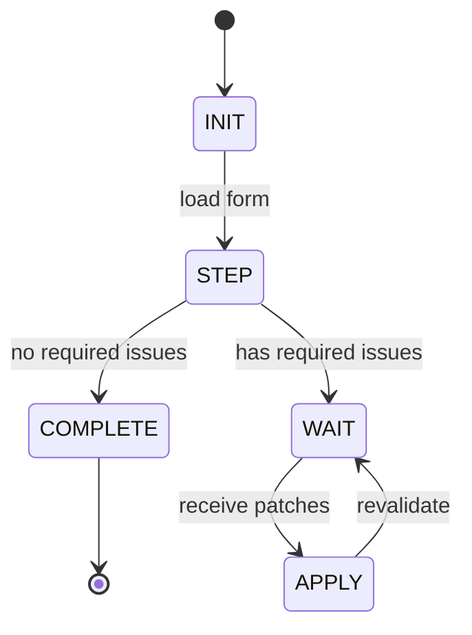
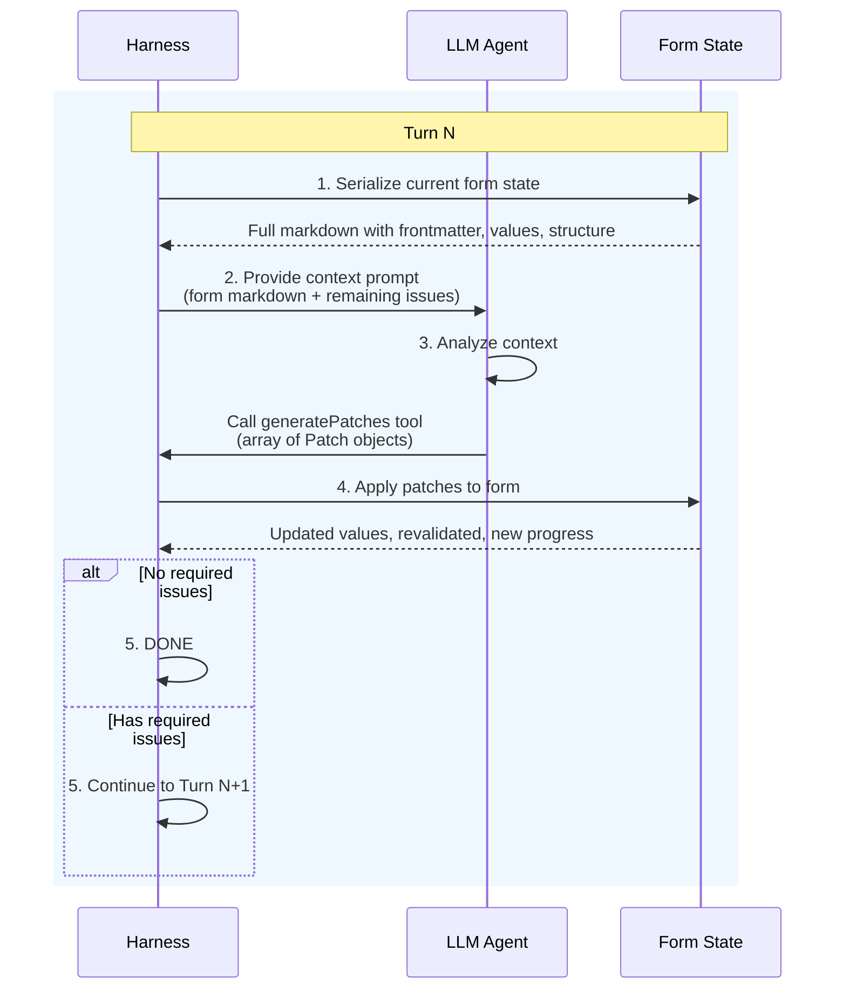

# Markform Design Overview

Version: MF/0.1 (proof of concept)

## Background

See **[the project readme](https://github.com/jlevy/markform)** for more background and
motivation.

## Architecture Roadmap

This section provides a high-level overview of the Markform architecture layers and
their relationships.
The architecture is designed to separate the **portable specification** (which could be
implemented in any language) from the **implementation-specific details** (specific to
this TypeScript codebase).

### Quick Reference

**Core Specification (Layers 1-4):**

| Layer | Name | Section |
| --- | --- | --- |
| 1 | Syntax | [Layer 1: Syntax](#layer-1-syntax) |
| 2 | Form Data Model | [Layer 2: Form Data Model](#layer-2-form-data-model) |
| 3 | Validation & Form Filling | [Layer 3: Validation & Form Filling](#layer-3-validation--form-filling) |
| 4 | Tool API & Interfaces | [Layer 4: Tool API & Interfaces](#layer-4-tool-api--interfaces) |

**Implementation Components:**

| Component | Section |
| --- | --- |
| Engine Implementation | [Engine Implementation](#engine-implementation) |
| Execution Harness | [Execution Harness](#execution-harness) |
| User Interfaces | [User Interfaces](#user-interfaces) |
| Agent Interfaces | [Agent Interfaces](#agent-interfaces) |
| Testing Framework | [Testing Framework](#testing-framework) |

### Specification vs Implementation Boundary

See [the README](README.md) for architecture diagram.

The **Markform Specification** (Layers 1-4) defines:

- **Layer 1 (Syntax):** What a `.form.md` file looks like—the file format itself

- **Layer 2 (Form Data Model):** The precise data structures for forms, fields, and
  values. Zod schemas provide precision but can be mapped to JSON Schema, Pydantic, or
  other schema languages for alternative implementations.

- **Layer 3 (Validation & Form Filling):** How validation works, how progress is
  computed, and how patches manipulate form state

- **Layer 4 (Tool API & Interfaces):** How agents and humans interact with forms—the
  abstract interface patterns, MCP tool definitions, and import/export formats

This specification could be implemented in any language (Python, Go, Rust, etc.)
and would produce interoperable `.form.md` files.

The **Implementation Components** are specific to this TypeScript codebase:

- **Engine Implementation:** The parser, serializer, and validation engine

- **User Interfaces:** CLI commands and web UI (specific to Node.js ecosystem)

- **Agent Interfaces:** Tool API library, MCP server, AI SDK integration

- **Execution Harness:** The step-by-step agent loop (a particular approach to
  agent-driven form filling, not required by the spec)

- **Testing Framework:** Golden session infrastructure (specific to this repository)

### Layer Dependencies

| Layer/Component | Depends On | Provides To |
| --- | --- | --- |
| 1. Syntax | (foundation) | Layer 2, Engine |
| 2. Form Data Model | Layer 1 | Layers 3, 4, Engine |
| 3. Validation & Form Filling | Layers 1, 2 | Layer 4, Engine |
| 4. Tool API & Interfaces | Layers 2, 3 | All interfaces |
| Engine Implementation | Layers 1-4 | Harness, Interfaces, Testing |
| Execution Harness | Engine | Agent Interfaces, Testing |
| User Interfaces | Engine | (end users) |
| Agent Interfaces | Engine, Harness | (agents) |
| Testing Framework | Engine, Harness | (developers) |

### Terminology

**Specification keywords:**

| Term | Definition |
| --- | --- |
| *required* | A constraint that MUST be satisfied. Enforced by engine validation; violations produce errors. |
| *recommended* | A convention that SHOULD be followed for consistency and best practices. Not enforced by the engine; violations do not produce errors. |

**Form concepts:**

| Term | Definition |
| --- | --- |
| **Field** | A single data entry point within a form. Fields have a kind (type), label, and optional constraints. |
| **Kind** | The type of a field. One of: `string`, `number`, `string_list`, `checkboxes`, `single_select`, `multi_select`, `url`, `url_list`. Determines the field's value structure, input behavior, and validation rules. |
| **Field group** | A container that organizes related fields together. Groups have an id, optional title, and may have custom validators. Currently (MF/0.1), groups contain only fields (they are not nested groups). |
| **Template form** | A form with no values filled in (schema only). Starting point for filling. |
| **Incomplete form** | A form with some values but not yet complete or valid. |
| **Completed form** | A form with all required fields filled and passing validation. |

**Checkbox modes:**

| Term | Definition |
| --- | --- |
| **Simple checkbox** | Checkbox mode with 2 states: `todo` and `done`. GFM-compatible. |
| **Multi checkbox** | Checkbox mode with 5 states: `todo`, `done`, `incomplete`, `active`, `na`. Default mode. |
| **Explicit checkbox** | Checkbox mode requiring explicit `yes`/`no` answer for each option. No implicit "unchecked = no". |

**Field state concepts:**

| Term | Definition |
| --- | --- |
| **AnswerState** | The action taken on a field: `unanswered` (no action), `answered` (has value), `skipped` (explicitly bypassed), `aborted` (explicitly abandoned). |
| **ProgressState** | Form-level completion status: `empty`, `incomplete`, `invalid`, `complete`. |
| **ProgressCounts** | Rollup counts with three orthogonal dimensions: AnswerState (unanswered/answered/skipped/aborted), Validity (valid/invalid), Value presence (empty/filled). |
| **FieldProgress** | Per-field progress info including `answerState`, `valid`, `empty`, and optional `checkboxProgress`. |

**Execution concepts:**

| Term | Definition |
| --- | --- |
| **Harness loop** | The execution wrapper that manages step-by-step form filling, tracking state and suggesting next actions. Also called just "harness" or "loop" — these refer to the same component. |
| **Session** | A single execution run from template form to completed form (or abandonment). |
| **Turn** | One iteration of the harness loop: inspect → recommend → apply patches → validate. |
| **Patch** | A single atomic change operation applied to form values (e.g., setting a string field, toggling checkboxes). |

**Testing and files:**

| Term | Definition |
| --- | --- |
| **Session transcript** | YAML serialization of a session's turns for golden testing (`.session.yaml`). |
| **Completed mock** | A pre-filled completed form file used in mock mode to provide deterministic "correct" values for testing. |
| **Sidecar file** | A companion file with the same basename but different extension (e.g., `X.form.md` → `X.valid.ts`). |

### Future: Extracting the Core Specification

The architecture is designed to allow extracting Layers 1-4 as a standalone **Markform
Specification** document that:

1. Defines the `.form.md` file format normatively (Layer 1)

2. Specifies the form data model precisely, with schemas mappable to JSON Schema,
   Pydantic, or other schema languages (Layer 2)

3. Provides validation rules, progress computation, and form manipulation semantics
   (Layer 3)

4. Documents the tool API and interface patterns for both agents and humans (Layer 4)

This would enable:

- Alternative implementations in other languages

- Formal specification for interoperability testing

- Clear separation between “what Markform is” and “how this library works”

### Document Organization

This document currently combines specification and implementation details.
Future versions may split into:

| Document | Content | Scope |
| --- | --- | --- |
| `markform-spec.md` | Core specification (portable) | Layers 1-4 |
| `markform-engine.md` | Engine implementation details | Engine |
| `markform-harness.md` | Execution harness design | Harness |
| `markform-interfaces.md` | CLI, Web UI, MCP, AI SDK | Interfaces |
| `markform-testing.md` | Golden session testing | Testing |

### Recommendations for Layer Separation

The following areas in this document could be improved to achieve cleaner layer
separation:

**1. Zod schemas as specification, not just implementation**

Layer 2 uses Zod schemas to define the form data model precisely.
This is intentional— Zod provides a rigorous way to specify schemas that can be mapped
to:

- JSON Schema (for language-agnostic interchange)

- Pydantic (for Python implementations)

- Other schema languages as needed

The specification should clarify that Zod is the *canonical notation* for precision,
while acknowledging that implementations may use equivalent schema definitions in their
native language.

**2. Clarify validation rules vs TypeScript types (Layer 3)**

Layer 3 “Validation & Form Filling” mixes:

- Normative rules (what validation MUST check) — belongs in spec

- TypeScript types like `ValidationIssue` — implementation detail

- Error codes and messages — should be normative for interoperability

Recommendation: Define normative validation rules as tables or prose.
The TypeScript types illustrate the structure but aren’t required for conformance.

**3. Layer 4 should fully specify the Tool API**

Layer 4 “Tool API & Interfaces” should include:

- Complete MCP tool definitions with method signatures

- All result types and their structures

- Import/export format specifications (JSON, YAML)

- Abstract UI patterns that any implementation should support

The current document partially specifies these.
A full specification would allow alternative implementations to be fully compatible at
the API level.

**4. Harness is implementation-specific**

The execution harness (step-by-step agent loop, mock mode, live mode) is specific to
this codebase’s approach to agent-driven form filling.
Other implementations might:

- Use different execution models (streaming, event-driven, etc.)

- Skip the harness entirely for direct API usage

- Define different session formats

Layer 4 should specify the Tool API without assuming harness concepts.

**5. Move npm package and implementation order to implementation sections**

The “NPM Package” and “Implementation Order” sections are purely implementation details.
They should follow the implementation components, not appear mixed with the
specification layers.

**6. Consolidate engine implementation details**

Create a dedicated “Engine Implementation” section that consolidates:

- Markdoc-based parser and serializer notes

- Validator loading (jiti)

- Any TypeScript-specific implementation patterns

Currently some implementation details are spread throughout Layers 1-4.

* * *

## MF/0.1 Scope

### Goals

- **Parse + validate + serialize** a `.form.md` Markdoc document containing: form
  schema, current values (template/incomplete/completed), inline documentation blocks,
  and validator references

- **Round-trip safely**: `.form.md` → model → canonical `.form.md` (deterministic
  output)

- **Unified operation contract** used by CLI, AI SDK tools, and web UI (MCP server in
  MF/0.2)

- **Incremental filling**: agent/user fills one or many fields at a time; tool returns
  “what’s missing next” + validation issues

- A form-filling **harness loop** with current errors + top-priority next steps,
  supporting mock mode (deterministic) and live mode (LLM-driven)

- **Golden session tests**: record/replay multi-turn sessions with ops + snapshots

### Explicit Non-Goals for MF/0.1 (Proof of Concept)

- Security hardening for sensitive/PII content (explicitly deferred)

- Conditional sections / branching logic (designed for extensibility, not implemented)

- Perfect “preserve exact original formatting” round-tripping (MF/0.1 canonicalizes
  output)

- PDF generation pipeline (HTML is enough; PDF later via print CSS)

- Python validator runtime (reserved; TypeScript first)

* * *

## Core Architecture

Everything (CLI, MCP, AI SDK, web, tests) uses **one shared engine** that implements the
Core Markform Specification (Layers 1-4):

**`MarkformEngine`** (implementation of Layer 4 operations)

- `parseForm(markdown: string): ParsedForm` — Layer 1 syntax → Layer 2 model

- `validate(form: ParsedForm, opts?): ValidationResult` — Layer 3 semantics

- `applyPatches(form: ParsedForm, patches: Patch[]): ApplyResult` — Layer 4 operation

- `serialize(form: ParsedForm, opts?): string` — Layer 2 model → Layer 1 syntax

- `exportJson(form: ParsedForm): { schema: FormSchemaJson; values: FormValuesJson }` —
  Layer 4 operation

This boundary enables “one set of tests, many interfaces.”

* * *

## Core Markform Specification

The normative specification for Markform syntax, data model, validation, and tool API is
defined in the standalone **[Markform Specification](./markform-spec.md)**.

The specification covers:

- **Layer 1: Syntax** — The `.form.md` file format, Markdoc tag syntax, checkbox state
  tokens, field value encoding, and serialization rules

- **Layer 2: Form Data Model** — TypeScript types, Zod schemas, StructureSummary and
  ProgressSummary types, and field type mappings

- **Layer 3: Validation & Form Filling** — Built-in validation rules, required field
  semantics, hook validator contract, and error taxonomy

- **Layer 4: Tool API & Interfaces** — Core operations (inspect, apply, export), patch
  schema, result types, priority scoring, and export formats

This implementation adheres to **MF/0.1** of the specification.

For complete normative definitions, see the specification.
The remainder of this document describes the TypeScript implementation details.

* * *

## Implementation Components

The following components are specific to this TypeScript codebase.
They implement the Markform Specification and provide execution, interface, and testing
capabilities.

**Note:** Engine implementation details (TypeScript types, Zod schemas) are currently
shown inline within the specification layers above.
A future refactor may consolidate these into a dedicated “Engine Implementation”
section.

### Execution Harness

The harness wraps the engine with a stable “step” protocol for bite-sized actions.
**Each turn is stateless:** the agent receives the full serialized form plus remaining
issues each turn—no conversation history is maintained.
The form itself IS the state.

#### Harness State Machine



<details> <summary>ASCII version (for comparison)</summary>

```
┌─────────┐
│  INIT  |
└────┬────┘
     │ load form
     ▼
┌─────────┐  no required   ┌──────────┐
│  STEP   │───────────────►│ COMPLETE │
└────┬────┘    issues      └──────────┘
     │ has required issues
     ▼
┌─────────┐
│  WAIT   │◄───────────────┐
└────┬────┘               |
     │ receive patches    |
     ▼                    |
┌─────────┐   revalidate  |
│  APPLY  │────────────────┘
└─────────┘
```

</details>

**Note:** MF/0.1 runs until completion (all required fields valid, no errors).
A default `max_turns` safety limit (e.g., 100) should be enforced to prevent runaway
loops during development and testing.
Exceeding `max_turns` results in an error state.

**Error Behavior:**

| Condition | Harness Status | CLI Exit Code |
| --- | --- | --- |
| Form completed successfully | `'complete'` | 0 |
| `max_turns` exceeded | `'max_turns_exceeded'` | 1 |
| Agent/LLM error | `'error'` | 1 |
| User cancelled | `'cancelled'` | 130 |

The harness returns a `HarnessResult` with `status` and optional `error` fields:

```ts
interface HarnessResult {
  status: 'complete' | 'max_turns_exceeded' | 'error' | 'cancelled';
  error?: Error;           // present when status is 'error'
  turnCount: number;       // total turns executed
  outputPath?: string;     // path to output file (when complete)
}
```

Integration tests can check `result.status` to verify expected outcomes without parsing
console output.

#### Harness Contract

The harness manages the form-filling loop but does not maintain session state beyond the
form itself. **The serialized form is the single source of truth.**

```ts
interface StepResult {
  structureSummary: StructureSummary;   // form structure overview (static)
  progressSummary: ProgressSummary;     // current filling progress (includes answeredFields, skippedFields)
  issues: InspectIssue[];               // unified list sorted by priority (ascending, 1 = highest)
  stepBudget: number;                   // suggested patches this turn (from config)
  isComplete: boolean;                  // true per completion formula (all fields answered/skipped, no required issues)
  turnNumber: number;
}
```

**Key behaviors:**

- `harness.step()` returns current state including summaries + issues

- `issues` is a single sorted list; filter by `severity: 'required'` to get blockers

- `stepBudget` comes from config (`max_patches_per_turn`), not computed dynamically

- Agent/user applies patches via `harness.apply(patches)`

- Harness revalidates and returns next `StepResult` with updated `progressSummary`

- Summaries allow agents/UIs to quickly display progress without parsing the full form

**Form-as-state principle:**

The harness does not track conversation history or accumulate context across turns.
Instead:

- Each turn, the agent receives the full serialized form (current state) + issues

- This is structurally equivalent to `markform inspect` output

- After patches are applied, the form is re-serialized with updated values

- The next turn sees the updated form, not a diff or delta

This design keeps turns short and controlled, enables easy debugging (any turn can be
replayed from its form snapshot), and avoids context window growth in long sessions.

#### Mocked Mode

- Uses a completed mock file: `X.mock.filled.form.md`

- Mock agent parses completed mock values and on each harness step picks recommended
  fields and applies patches using those values

- Deterministic and perfect for golden tests

- No LLM calls required

#### Stateless Turn Context Design

A key architectural decision is that **each agent turn is stateless**. The agent does
not maintain conversation history across turns.
Instead, the full form context is provided fresh each turn:

**Turn Context = Full Form Markdown + Remaining Issues**

This mirrors what `markform inspect` outputs, making each turn self-contained:

```
┌──────────────────────────────────────────────────────────────────────────────┐
│ Turn N Context (User Prompt)                                                |
├──────────────────────────────────────────────────────────────────────────────┤
│ # Current Form State                                                        |
│                                                                             |
│ Below is the complete form with all currently filled values.                |
│ Fields marked with `[ ]` or empty values still need to be filled.           |
│                                                                             |
│ ```markdown                                                                 |
│ ---                                                                         |
│ markform:                                                                   |
│   spec: MF/0.1                                                 |
│   form_state: incomplete                                                    |
│   ...                                                                       |
│ ---                                                                         |
│                                                      |
│                                    |
│ ```value                                                                    |
│ Alice                                                                       |
│ ```                                                                         |
│                                                          |
│              |
│ ...                                                                         |
│                                                                  |
│ ```                                                                         |
│                                                                             |
│ # Remaining Issues                                                          |
│                                                                             |
│ - **email** (field): Required field 'Email' has no value                    |
│   Severity: required, Priority: P1                                          |
│   Type: string                                                              |
│ ...                                                                         |
└──────────────────────────────────────────────────────────────────────────────┘
```

**Why stateless turns?**

1. **The form IS the state** — All filled values, progress, and structure are encoded in
   the serialized form markdown.
   No separate state tracking needed.

2. **Simpler implementation** — No conversation history management, memory limits, or
   context window concerns across turns.

3. **Debuggable** — Each turn’s context is complete and self-contained.
   You can replay any turn by providing its form snapshot.

4. **Consistent with inspect** — The turn context is structurally identical to what
   `markform inspect` outputs, enabling agents to understand form state the same way
   humans do via CLI.

5. **Token efficient for iterative fills** — While each turn includes the full form,
   this is typically smaller than accumulated conversation history for multi-turn
   sessions.

**Implementation:**

The agent receives the serialized form (via `serialize(form)`) plus the remaining issues
list as its prompt each turn.
After generating patches, the harness applies them, revalidates, and provides the
updated form for the next turn.

#### Live Mode (AI SDK)

Uses [AI SDK tool calling][ai-sdk-tool-calling] with agentic loop control from
[AI SDK 5][ai-sdk-5] and [AI SDK 6][ai-sdk-6]:

- Each turn is stateless—the agent sees the full form markdown + remaining issues

- The form itself carries all state (filled values, validation status, progress)

- No conversation history is accumulated between turns

- Define a `generatePatches` tool using AI SDK `tool({ inputSchema: zod })`

- Control multi-step behavior with `stopWhen: stepCountIs(k)` for “1–3 tool calls per
  turn” (see [AI SDK 5][ai-sdk-5] for `stepCountIs`)

- Agent analyzes form state and issues, then calls `generatePatches` with patches

- Harness applies patches, revalidates, serializes updated form

- Next turn receives fresh context with updated form state

- Repeat until complete (no required issues remaining)

**Turn flow:**



<details> <summary>ASCII version (for comparison)</summary>

```
┌─────────────────────────────────────────────────────────────────────────────┐
│                              Turn N                                        |
├─────────────────────────────────────────────────────────────────────────────┤
│                                                                            |
│   1. Harness serializes current form state                                 |
│      └─► Full markdown with frontmatter, values, structure                 |
│                                                                            |
│   2. Harness provides context prompt                                       |
│      └─► Form markdown + remaining issues (like `inspect` output)          |
│                                                                            |
│   3. LLM analyzes context, calls generatePatches tool                      |
│      └─► Returns array of Patch objects                                    |
│                                                                            |
│   4. Harness applies patches to form                                       |
│      └─► Updates values, revalidates, computes new progress                |
│                                                                            |
│   5. Check completion                                                      |
│      └─► If no required issues: DONE                                       |
│      └─► Otherwise: Go to Turn N+1 with updated form                       |
│                                                                            |
└─────────────────────────────────────────────────────────────────────────────┘
```

</details>

#### Research Workflow

The research workflow is a specialized application of the harness loop for web-search-
enabled research tasks.
It provides:

1. **Research forms** — Forms with `user` role fields (problem definition) followed by
   `agent` role fields (research tasks).
   User fields come first, agent fields follow.

2. **Web search requirement** — Research requires models with native web search support
   (OpenAI, Google, xAI). The workflow validates this before execution.

3. **Research-specific defaults** — Lower `maxIssuesPerTurn` (3 vs 10) and
   `maxGroupsPerTurn` (1) to encourage focused, deep research on one section at a time.

4. **Frontmatter configuration** — Research forms can specify harness parameters in YAML
   frontmatter under `markform.harness`.

**API Design:**

The research API follows the “thin wrapper” pattern—same options type, different
behavior:

```typescript
// Same FillOptions type for both APIs - no separate ResearchOptions
async function fillForm(options: FillOptions): Promise<FillResult>;
async function runResearch(options: FillOptions): Promise<ResearchResult>;

// runResearch() validates then delegates to fillForm()
// 1. Validate research form structure (user fields, then agent fields)
// 2. Validate model supports web search
// 3. Apply RESEARCH_DEFAULTS for config
// 4. Delegate to fillForm() for execution
```

If you don’t want research validation, use `fillForm()` directly.
This avoids code duplication—`runResearch()` adds validation and defaults but reuses
`fillForm()` for all execution logic.

* * *

### API Design Principles

#### String-Based Core APIs

Core APIs (`fillForm()`, `runResearch()`) work with **strings and in-memory objects**,
not file paths:

```typescript
// Core API signature - string or ParsedForm, returns string
async function fillForm(options: {
  form: string | ParsedForm;  // Not a file path
  model: string | LanguageModel;
  // ...
}): Promise<FillResult>;  // result.markdown is the output string
```

**Benefits:**

- **Testable** — Unit tests can pass strings directly without file fixtures

- **Composable** — APIs can be chained without intermediate file I/O

- **Platform-agnostic** — Works in browsers, serverless, anywhere without filesystem

#### File I/O at CLI Layer

File operations are handled **exclusively in CLI commands**, not core APIs:

```typescript
// CLI command handles file I/O
const formContent = await readFile(inputPath, 'utf-8');
const result = await fillForm({ form: formContent, model });
await exportMultiFormat(result.form, outputPath, formats);
```

**Implementation:**

- `src/cli/lib/fileHelpers.ts` — Shared file reading utilities

- `src/cli/lib/exportHelpers.ts` — `exportMultiFormat()` for output

- Each CLI command reads input, calls core API, writes output

This keeps core APIs simple and focused while CLI commands handle the “glue” of
reading/writing files, parsing CLI arguments, and user interaction.

* * *

### User Interfaces

#### CLI Commands (MF/0.1)

Thin wrapper around the tool contract:

**Core commands (required for MF/0.1):**

- `markform inspect <file.form.md>` — parse + run validators, print full report as YAML
  (structure summary, progress summary, form state, and all issues in priority order).
  This is the canonical way to check form status at any time.

- `markform apply <file.form.md> --patch <json>` — apply patches, write canonical file

- `markform export <file.form.md> --format=json` — print `{schema, values}`

- `markform render <file.form.md> [-o <file.html>]` — render form as static HTML output:

  - Default output: same stem with `.form.html` extension (e.g., `simple.form.md` →
    `simple.form.html`)

  - Use `-o` / `--output` to specify custom output path

  - Shares rendering logic with serve command

  - Useful for sharing/archiving forms without running a server

- `markform serve [<file.form.md>]` — start a local web UI for interactive form editing:

  - Opens browser automatically (use `--no-open` to disable)

  - Interactive HTML form elements for all field types

  - Save writes to a new versioned filename (never overwrites the source)

  - Version naming: if the stem ends with a version pattern (e.g., `-v1`, `_v2`, ` v3`),
    extract and increment the number; otherwise append `-v1`

  - Examples:

    - `earnings-analysis.form.md` → `quarterly-v1.form.md` → `quarterly-v2.form.md`

    - `report_v5.form.md` → `report_v6.form.md`

    - `draft v12.form.md` → `draft v13.form.md`

- `markform fill <file.form.md> --mock --mock-source <file>` — fill form using mock
  agent, write session transcript

- `markform fill <file.form.md> --model=anthropic/claude-sonnet-4-5` — fill form using
  live LLM agent

- `markform research <file.form.md> --model=openai/gpt-4o` — run research workflow on a
  research form:

  - Validates form is a valid research form (user fields, then agent fields)

  - Validates model supports web search (fails fast if not)

  - Applies research-specific defaults (maxIssuesPerTurn: 3, maxGroupsPerTurn: 1)

  - Supports `--initial-values=<file.json/yml>` for pre-filling user fields

  - Supports `-- field=value` pairs for inline field values

  - Writes output to versioned filename with multiple export formats

- `markform examples` — interactive menu to explore and run example forms:

  - Lists available example forms with descriptions

  - Shows form type: `[interactive]` for standard forms, `[research]` for research forms

  - For research forms: uses web-search model selection and research workflow

  - For standard forms: uses interactive filling

**Deferred to MF/0.2:**

- **Validation in serve** — Run engine validation from the UI with a “Validate” button.
  Requires deciding on validator execution strategy (see Future Considerations for
  research on server-executed vs baked validators).

- **JSON endpoints** — Expose inspect/apply/export as HTTP endpoints for programmatic
  clients.

- **Harness controls** — Step through the harness loop from the UI.

#### Web UI (serve)

The MF/0.1 “serve” command provides an interactive web UI for editing and saving forms:

- Opens browser automatically (use `--no-open` to disable)

- Renders all field types as interactive HTML form elements:

  - String fields → `<input type="text">` with minLength/maxLength

  - Number fields → `<input type="number">` with min/max/step

  - String list fields → `<textarea>` with one item per line

  - Single-select → `<select>` dropdown with options

  - Multi-select → checkboxes for each option

  - Checkboxes (simple mode) → HTML checkboxes (checked/unchecked)

  - Checkboxes (multi mode) → select dropdowns with 5 states
    (todo/done/active/incomplete/na)

  - Checkboxes (explicit mode) → select dropdowns with yes/no/unfilled

- Pre-fills current values from the form file

- Form submission via POST /save:

  - Applies patches from form data to the in-memory form state

  - Canonicalizes and writes to a new versioned filename (never overwrites original)

  - Version naming: if stem ends with `-vN`, `_vN`, or ` vN`, increment N; otherwise
    append `-v1`

  - Returns JSON response with success status and output path

- CSS styling provides clean, readable form layout

**Deferred to MF/0.2:**

- Validation in serve (run engine validation from UI with a “Validate” button)

- JSON endpoints for programmatic access

- Harness controls (step through the harness loop from the UI)

Use `markform inspect <file>` from the CLI at any time to get a full report (YAML with
summaries, form state, and prioritized issues).

### Programmatic APIs

#### fillForm()

The primary programmatic entry point for form filling:

```typescript
import { fillForm } from 'markform';

const result = await fillForm({
  form: formMarkdown,                        // string or ParsedForm
  model: 'anthropic/claude-sonnet-4-5',      // model identifier
  inputContext: { company_name: 'Acme' },    // pre-fill values
  onTurnComplete: (progress) => { ... },     // progress callback
});

if (result.status.ok) {
  console.log(result.values);   // field values
  console.log(result.markdown); // completed form
}
```

#### runResearch()

Specialized wrapper for research workflows.
Takes the same `FillOptions` as `fillForm()`:

```typescript
import { runResearch } from 'markform';

const result = await runResearch({
  form: researchFormMarkdown,
  model: 'openai/gpt-4o',           // must support web search
  inputContext: { topic: '...' },   // user field values
});
// Returns ResearchResult (extends FillResult)
```

Key differences from `fillForm()`:

- Validates form has research structure (user fields before agent fields)

- Validates model supports web search (fails fast if not)

- Applies `RESEARCH_DEFAULTS` (maxIssuesPerTurn: 3, maxGroupsPerTurn: 1)

If you don’t want these validations, use `fillForm()` directly with manual defaults.

Both APIs work with strings (not file paths) for testability and composability.
See API Design Principles above.

### Agent Interfaces

#### AI SDK Integration

Provides [Vercel AI SDK][ai-sdk-tools] compatible tools for agent-driven form filling.

**Session Store:**

The `MarkformSessionStore` class manages form state during AI interactions:

```ts
class MarkformSessionStore {
  constructor(form: ParsedForm, validatorRegistry?: ValidatorRegistry)
  getForm(): ParsedForm
  getValidatorRegistry(): ValidatorRegistry
  updateForm(form: ParsedForm): void
}
```

**Factory Function:**

```ts
function createMarkformTools(options: CreateMarkformToolsOptions): MarkformToolSet

interface CreateMarkformToolsOptions {
  sessionStore: MarkformSessionStore;
  includeGetMarkdown?: boolean;  // default: true
}
```

**Tool Definitions:**

| Tool | Input | Output | Description |
| --- | --- | --- | --- |
| `markform_inspect` | `{}` | `InspectToolResult` | Get form state, structure, progress, and validation issues |
| `markform_apply` | `{ patches: Patch[] }` | `ApplyToolResult` | Apply 1-20 patches to update field values |
| `markform_export` | `{}` | `ExportToolResult` | Export schema and values as JSON |
| `markform_get_markdown` | `{}` | `GetMarkdownToolResult` | Get canonical markdown (optional) |

**Result Types:**

```ts
// All tool results follow this pattern
interface ToolResult<T> {
  success: boolean;
  data: T;
  message: string;
}

// InspectToolResult.data is InspectResult (see Layer 4)
// ApplyToolResult.data is ApplyResult (see Layer 4)
// ExportToolResult.data is { schema: FormSchema; values: Record<Id, FieldResponse> }
// GetMarkdownToolResult.data is { markdown: string }
```

**Usage Example:**

```ts
import { parseForm } from 'markform';
import { createMarkformTools, MarkformSessionStore } from 'markform/ai-sdk';
import { generateText } from 'ai';

const form = parseForm(markdownContent);
const store = new MarkformSessionStore(form);
const tools = createMarkformTools({ sessionStore: store });

const { text } = await generateText({
  model: openai('gpt-4'),
  tools,
  prompt: 'Fill out this form...',
});
```

#### MCP Server Integration (MF/0.2)

Built on the [Model Context Protocol Specification][mcp-spec] using the
[official TypeScript SDK][mcp-typescript-sdk]. See [MCP SDKs overview][mcp-sdks] for
client/server patterns.

Tools correspond to the same operations:

- `markform.inspect`

- `markform.apply`

- `markform.export`

- `markform.get_markdown`

**Transport:** stdio for local CLI integration (see MCP transports documentation).

**AI SDK interop:** Use [AI SDK MCP tools][ai-sdk-mcp] to connect AI SDK agents to the
Markform MCP server.

* * *

### Testing Framework

Provides a unified testing approach covering parsing/serialization, tool operations,
validation behavior, harness behavior, and all adapters.

#### Golden Session Format

A golden test is a YAML file containing:

- Initial artifacts (`.form.md` and validators)

- Sequence of steps/turns with operations, issues, and resulting form snapshot/diff

#### Session Transcript Schema

Session transcripts record the form state at each turn, not conversation history.
Since each turn is stateless, the transcript captures the form snapshot (or hash) and
patches applied at each step.

```yaml
session_version: 0.1
mode: mock  # mock | live (see explanation below)
form:
  path: examples/earnings-analysis/earnings-analysis.form.md
validators:
  code: examples/earnings-analysis/earnings-analysis.valid.ts  # optional
mock:
  completed_mock: examples/earnings-analysis/earnings-analysis.mock.filled.form.md

harness:
  max_issues: 5              # max issues to return per turn
  max_patches_per_turn: 3    # stepBudget value
  max_turns: 100             # safety limit (default: 100)

turns:
  - turn: 1
    # Form state at start of turn (what agent sees)
    form_state: incomplete          # from frontmatter form_state
    required_issues_before: 5       # count of severity: required issues
    # Patches generated by agent
    patches:
      - { op: set_string, fieldId: company_name, value: "ACME Corp" }
    # State after patches applied
    after:
      required_issues_remaining: 4
      form_state: incomplete
      markdown_sha256: "..."        # for deterministic verification
    # Optional: LLM stats for live sessions
    stats:
      input_tokens: 1234
      output_tokens: 456
      tool_calls: 1

final:
  expect_complete: true
  expected_completed_form: examples/earnings-analysis/earnings-analysis.mock.filled.form.md
```

**Mode field semantics:**

| Mode | Purpose | `turns` field | Reproducible |
| --- | --- | --- | --- |
| `mock` | CI testing with deterministic values | Pre-recorded, replayed exactly | Yes |
| `live` | Development logging of real LLM sessions | Recorded during execution | No |

For `mode: live`, the session transcript is an **output** (recorded log), not an input
for replay. Live sessions are useful for debugging but not for CI assertions.

**Note on stateless recording:** Since each turn is stateless (agent receives full form
each time), the transcript does not need to record conversation messages.
The form markdown at each turn can be reconstructed by applying patches sequentially
from the initial template, or by storing the `markdown_sha256` for verification.

#### Test Modes

**A) Mocked mode (CI-friendly):**

- Check in: `X.form.md` (template), `X.mock.filled.form.md` (completed mock),
  `X.session.yaml`

- Mock agent reads completed mock and plays back values by issuing tool calls

- Final assertion: resulting completed form matches completed mock exactly

**B) Live mode (developer workflow):**

- Run harness with a real model

- Produces session transcript

- Useful for exploratory testing, not strict CI

* * *

## NPM Package

First release as **`markform`** on npm.

MF/0.1 includes:

- Core library

- CLI binary

- Golden test runner

**Key dependencies:**

- `@markdoc/markdoc` — parsing and AST

- `zod` — schema validation

- `jiti` — runtime TypeScript loading for `.valid.ts` validators

- `yaml` — YAML parsing/serialization for frontmatter and CLI output

Future split into `markform-cli`, `markform-ai-sdk`, etc.
is optional later.

* * *

## Golden Example Set for MF/0.1

### Example 1: `quarterly_earnings_analysis` (mocked)

Files:

- `examples/earnings-analysis/earnings-analysis.form.md` (template form)

- `examples/earnings-analysis/earnings-analysis.mock.filled.form.md` (completed mock
  with checkbox states and values)

- `examples/earnings-analysis/earnings-analysis.valid.ts` (code validators)

- `examples/earnings-analysis/earnings-analysis.session.yaml` (session transcript)

### Example 2: Small smoke test form

A tiny form for fast debugging:

- One group, one checkbox set, one string field

- A session with 2 turns

These validate: parsing, serialization stability, checkbox multi-state handling, select
parsing, tool patches, harness logic.

* * *

## Implementation Order

### 1) Core Zod schemas + TypeScript types

`FormSchema`, `Field`, `Values`, `DocumentationBlock`, `Patch`, `ValidationIssue`,
`SessionYaml`, `StructureSummary`, `ProgressSummary`, `MarkformFrontmatter`

Deliverable: `engine/types.ts` + `engine/schemas.ts`

### 2) Markdoc parsing to canonical model

Frontmatter parsing, AST walk, extract tags/options/values, semantic validation

Deliverable: `engine/parse.ts`

### 3) Canonical serialization

Deterministic output, omit empty value fences, `#id` annotations.
Include `form_summary` and `form_progress` in frontmatter (computed during serialize).

Deliverable: `engine/serialize.ts`

### 4) Built-in validation + inspect heuristic + summaries

Required, numeric, select constraints, completion stats, issue prioritization.
Implement `computeStructureSummary(schema)` and `computeProgressSummary(schema, values,
issues)`.

Deliverable: `engine/validate.ts` + `engine/inspect.ts` + `engine/summaries.ts`

### 5) Patch application

Apply patches, validate correctness, return updated `ParsedForm`

Deliverable: `engine/apply.ts`

### 6) Harness

Step protocol, mocked agent mode, live agent mode interface

Deliverable: `harness/harness.ts` + `harness/mockAgent.ts`

### 7) Golden session runner

Record: run harness, emit session transcript + final form.
Replay: load session, replay patches, verify snapshots.

Deliverable: `tests/goldenRunner.ts`

### 8) CLI

`inspect`, `apply`, `export`, `render`, `serve`, `fill`

Deliverable: `cli/commands/*`

### 9) AI SDK tools

Tool set using AI SDK `tool()` + Zod input schemas

Deliverable: `integrations/vercelAiSdkTools.ts`

### 10) MCP server mode (MF/0.2)

MCP tools for inspect/apply/export using TS SDK, stdio transport

Deliverable: `integrations/mcp.ts`

**Note:** Deferred to MF/0.2 to reduce MF/0.1 scope.
Full specification included above.

* * *

## What “Done” Looks Like for MF/0.1

1. Write `earnings-analysis.form.md` (template) and
   `earnings-analysis.mock.filled.form.md` (completed mock)

2. Run:

   - `markform inspect examples/earnings-analysis/earnings-analysis.form.md` — prints
     YAML report with structure summary, progress summary, form state, and all issues in
     priority order

   - `markform serve examples/earnings-analysis/earnings-analysis.form.md` — open the
     browser, browse the form; Save to confirm output path (defaults to
     `quarterly-v1.form.md`); run `markform inspect` separately at any time to check
     status

   - `markform fill examples/earnings-analysis/earnings-analysis.form.md --mock
     --mock-source examples/earnings-analysis/earnings-analysis.mock.filled.form.md
     --record examples/earnings-analysis/earnings-analysis.session.yaml`

3. Run tests:

   - Replay the session transcript

   - Confirm same patches applied, same digests after each turn

   - Final completed form matches expected file exactly

* * *

## Future Extensions

### MF/0.2 Targets

Specified in this document but deferred from MF/0.1 proof of concept:

- **MCP server integration** — Full spec included above; deferred to reduce MF/0.1 scope

- **Radio button syntax** — `( )` / `(x)` markers for `single-select` as visual
  differentiation from multi-select (currently both use `[ ]` for markdown
  compatibility)

- **Max iteration limits** — Configurable `max_turns` for harness safety/cost control

- **Repeating groups** — Array of structured objects for when list items need structure
  (e.g., a risk entry with description, severity, likelihood, mitigation, owner).
  Maps to JSON Schema `type: "array"` with `items: { type: "object" }`. Instance IDs are
  auto-generated with sequential suffixes: `{base_id}_1`, `{base_id}_2`.
  ```md
  
    
    ...
    
  
  ```

- **string-list enhancements:**

  - `itemPattern` — Regex validation per item

  - `trimMode` — Attribute to control whitespace handling

  - Item-level patch operations (insert/remove/reorder)

- **`allowOther` attribute for select fields** — Enable “Other: ____” free-text option
  for `single-select` and `multi-select` fields.
  When `allowOther=true`, users can provide a custom value not in the predefined option
  list.

  ```md
  
  - [ ] Physical 
  - [ ] Digital 
  - [ ] Hybrid 
  
  ```

  Schema additions:

  - `SingleSelectField.allowOther?: boolean`

  - `MultiSelectField.allowOther?: boolean`

  - `FieldValue` gains `otherValue?: string` property for select types

  The reserved option ID `_other` is used when the user selects “Other”.
  Serialization: `- [x] Other: Custom value here `

- **`date-field` type** — Dedicated field type for date values with built-in parsing and
  validation. Supports ISO 8601 format by default.

  ```md
  
  
  ```

  Attributes:

  - `format`: Date format string (default: `YYYY-MM-DD` / ISO 8601)

  - `min`: Minimum date constraint

  - `max`: Maximum date constraint

  TypeScript types:
  ```ts
  interface DateField extends FieldBase {
    kind: 'date';
    format?: string;           // default: 'YYYY-MM-DD'
    min?: string;              // minimum date in same format
    max?: string;              // maximum date in same format
  }
  
  // FieldValue
  | { kind: 'date'; value: string | null }  // stored in normalized ISO format
  
  // Patch
  | { op: 'set_date'; fieldId: Id; value: string | null }
  ```

  FieldKind enum gains `'date'` value.

### Later Versions

Documented but not required for MF/0.1 or MF/0.2:

- **Nested field groups** — MF/0.1/0.2 support only flat field groups (groups contain
  fields, not other groups).
  Nested groups for hierarchical organization deferred to a future version.
  Use flat groups with descriptive IDs like `pricing_structure`, `pricing_margin_cost`
  for now.

- **`requiredIf` conditional validation** — Declarative attribute to make a field
  required based on another field’s value.
  For now, use code validators for conditional requirements (see Custom Validator
  Patterns section). A declarative `requiredIf` attribute may be added later for common
  patterns.

- Conditional enable/disable of groups/fields based on earlier answers

- Section-level grouping with conditional activation

- Rich numeric types (currency, percent, units, precision, tolerances)

- “Report-quality rendering” (templates, charts), PDF export

- More advanced UI schema/layout options

- Stronger LLM validator security model and redaction policies

* * *

## References

For complete reference documentation, see the
[Markform Specification](./markform-spec.md#references).

Key references used in this implementation document:

* * *

<!-- Reference Link Definitions -->

<!-- Markdoc -->

[markdoc-overview]: https://markdoc.dev/docs/overview "What is Markdoc?"
[markdoc-spec]: https://markdoc.dev/spec "Markdoc Tag Syntax Specification"
[markdoc-syntax]: https://markdoc.dev/docs/syntax "The Markdoc Syntax"
[markdoc-tags]: https://markdoc.dev/docs/tags "Markdoc Tags"
[markdoc-attributes]: https://markdoc.dev/docs/attributes "Markdoc Attributes"
[markdoc-nodes]: https://markdoc.dev/docs/nodes "Markdoc Nodes"
[markdoc-validation]: https://markdoc.dev/docs/validation "Markdoc Validation"
[markdoc-frontmatter]: https://markdoc.dev/docs/frontmatter "Markdoc Frontmatter"
[markdoc-format]: https://markdoc.dev/docs/format "Markdoc Formatting"
[markdoc-render]: https://markdoc.dev/docs/render "Markdoc Render Phases"
[markdoc-getting-started]: https://markdoc.dev/docs/getting-started "Get Started with Markdoc"
[markdoc-config]: https://markdoc.dev/docs/config "Markdoc Config Objects"
[markdoc-examples]: https://markdoc.dev/docs/examples "Markdoc Common Examples"
[markdoc-github]: https://github.com/markdoc/markdoc "markdoc/markdoc on GitHub"
[markdoc-language-server]: https://github.com/markdoc/language-server "markdoc/language-server on GitHub"
[markdoc-faq]: https://markdoc.dev/docs/faq "Markdoc FAQ"
[markdoc-process-false]: https://github.com/markdoc/markdoc/discussions/261 "process=false Discussion"
[stripe-markdoc]: https://stripe.com/blog/markdoc "How Stripe builds interactive docs with Markdoc"

<!-- AI SDK -->

[ai-sdk-tools]: https://ai-sdk.dev/docs/foundations/tools "AI SDK: Tools"
[ai-sdk-tool-calling]: https://ai-sdk.dev/docs/ai-sdk-core/tools-and-tool-calling "AI SDK: Tool Calling"
[ai-sdk-mcp]: https://ai-sdk.dev/docs/ai-sdk-core/mcp-tools "AI SDK: MCP Tools"
[ai-sdk-5]: https://vercel.com/blog/ai-sdk-5 "AI SDK 5"
[ai-sdk-6]: https://vercel.com/blog/ai-sdk-6 "AI SDK 6"

<!-- MCP -->

[mcp-spec]: https://modelcontextprotocol.io/specification/2025-11-25 "MCP Specification"
[mcp-sdks]: https://modelcontextprotocol.io/docs/sdk "MCP SDKs"
[mcp-typescript-sdk]: https://github.com/modelcontextprotocol/typescript-sdk "MCP TypeScript SDK"

<!-- Task Lists -->

[gfm-tasklists]: https://github.github.com/gfm/#task-list-items-extension- "GFM Task List Items"
[github-tasklists]: https://docs.github.com/github/writing-on-github/getting-started-with-writing-and-formatting-on-github/basic-writing-and-formatting-syntax "GitHub Basic Formatting"
[github-about-tasklists]: https://docs.github.com/en/get-started/writing-on-github/working-with-advanced-formatting/about-tasklists "GitHub About Tasklists"
[obsidian-tasks-forum]: https://forum.obsidian.md/t/partially-completed-tasks/53258 "Obsidian: Partially Completed Tasks"
[obsidian-tasks-discussion]: https://github.com/obsidian-tasks-group/obsidian-tasks/discussions/68 "Obsidian Tasks: Add DOING Status"
[obsidian-tasks-guide]: https://obsidian.rocks/power-features-of-tasks-in-obsidian/ "Power Features of Tasks in Obsidian"

<!-- Schema/Validation -->

[zod]: https://zod.dev/ "Zod"
[zod-api]: https://zod.dev/api "Zod API"
[zod-to-json-schema]: https://github.com/StefanTerdell/zod-to-json-schema "zod-to-json-schema"
[json-schema-validation]: https://json-schema.org/draft/2020-12/json-schema-validation "JSON Schema Validation"
[json-schema-array]: https://json-schema.org/understanding-json-schema/reference/array "JSON Schema: Array"

* * *

## Design Decisions

This section documents design decisions made during architecture planning.
All items are resolved unless explicitly marked as open questions in the final
subsection.

### Core Field Behavior (MF/0.1)

1. **String field whitespace handling** — Whitespace-only values are equivalent to empty
   values for all purposes: `value.trim() === ""` means “no value provided.”
   For required fields, this means whitespace-only fails validation.
   For optional fields, whitespace-only is treated as empty (valid but unfilled).
   A `trimMode` attribute to customize this behavior is deferred to post-MF/0.2.

2. **Labels required on fields** — The `label` attribute is required on all field types
   (`label: string` in `FieldBase`). Missing label produces a parse error.
   Group/form titles remain optional.
   See Parsing Strategy (semantic validation).

3. **Option ID scoping** — Option IDs are **field-scoped** (unique within field, not
   globally). This allows reusing common patterns like `[ ] 10-K ` across
   multiple fields. When referencing options externally (doc blocks), use qualified form
   `{fieldId}.{optionId}`. In patches and FieldValue, options are already scoped by the
   field context. This is compatible with Markdoc since `` just sets an
   attribute—Markdoc doesn’t enforce uniqueness.

4. **Unknown option IDs handled strictly** — Option ID handling is fully specified:

   - Parse time: Missing `` annotation on options → parse error

   - Parse time: Duplicate option IDs within a field → parse error

   - Patch time: Unknown option ID in patch → `INVALID_OPTION_ID` error, batch rejected

   See Parsing Strategy (semantic validation) and Patch validation layers sections.

5. **Checkbox `simple` mode completion semantics** — The `minDone` attribute (integer,
   default `-1`) controls completion threshold.
   When `minDone=-1` (default), all options must be `done`. Setting `minDone=1` allows
   “at least one done” semantics, and `minDone=0` makes the field effectively optional.
   This flexible approach avoids needing separate modes like `simple_strict` vs
   `simple_optional`.

6. **Skip field semantics** — The `skip_field` patch operation provides a way for agents
   to explicitly skip optional fields without providing a value.
   Key design decisions:

   - **Only optional fields can be skipped:** Required fields reject `skip_field` with a
     validation error. This ensures critical data is always provided.

   - **Skip state is serialized to markdown:** Skipped fields are marked with
     `state="skipped"` attribute and may include a sentinel value with the skip reason.
     The skip state is tracked in `ParsedForm.responsesByFieldId` (as responseState) and
     reflected in `FieldProgress.responseState` and `ProgressCounts.skippedFields`.

   - **Completion formula:** `isComplete = all fields answered or skipped` AND
     `abortedFields == 0`. This requires agents to actively respond to every field.

   - **Skip clears existing value:** Skipping a field that already has a value clears
     the value. The field transitions from answered → skipped.

   - **Setting value clears skip:** Applying a value patch to a skipped field removes
     the skip state. The field transitions from skipped → answered.

   - **Agent visibility in stateless turns:** Agents see field state via the issues list
     (skipped fields removed from issues) and progress counts (skippedFields count).
     This provides implicit feedback that skipping was successful.

7. **Unified response model (markform-203/204/205)** — The unified response model
   consolidates field state management into a single, orthogonal system:

   **Design rationale:**

   - **Response state is orthogonal to field type:** Any field can be empty, answered,
     skipped, or aborted, regardless of its type (string, number, checkboxes, etc.).
     This separation reduces complexity and makes the model more predictable.

   - **Single source of truth:** `responsesByFieldId` replaces separate
     `valuesByFieldId` and `skipsByFieldId` maps.
     Each field has exactly one FieldResponse with a state and optional value,
     eliminating sync issues between multiple data structures.

   - **Four response states:** The model distinguishes:

     - `empty`: No response provided yet

     - `answered`: Field has a value (value present in FieldResponse)

     - `skipped`: Explicitly skipped (optional fields only)

     - `aborted`: Marked as unable to complete (blocks completion)

   - **Abort vs skip semantics:** Skip is for optional fields that won’t be filled.
     Abort is for fields that can’t be completed but should be visible as blockers.
     This distinction allows agents to signal “I can’t answer this” without silently
     accepting incomplete data.

   - **Notes as first-class data:** Notes are stored separately in `ParsedForm.notes`
     rather than embedded in field values.
     This allows:

     - Multiple notes per field/group/form

     - Notes from different roles

     - Notes linked to skip/abort actions via the `state` attribute

     - Clean separation between field values and metadata

   - **Serialization consistency:** Skip and abort states are serialized via `state`
     attribute on field tags, making them visible in the markdown.
     Sentinel values (`%SKIP%`, `%ABORT%`) encode reasons when present.
     This ensures the markdown is self-documenting and human-readable.

   - **Completion semantics:** Completion requires all role-filtered fields to be
     answered or skipped, AND abortedFields == 0. This ensures:

     - Agents must address every field (no silent ignoring)

     - Aborted fields are visible as blockers requiring intervention

     - Forms can’t be completed with outstanding problems

### string-list Field (MF/0.1)

6. **Empty string handling** — Empty strings (after trimming) are silently discarded.
   If users need explicit empty entries, that’s a different data modeling need.

7. **Whitespace handling** — Always trim leading/trailing whitespace from items;
   preserve internal whitespace.
   A `trimMode` attribute to customize this behavior is deferred to MF/0.2+.

8. **Item-level patterns** — `itemPattern` (regex validation per item) is deferred to
   MF/0.2+. MF/0.1 focuses on cardinality constraints only.

9. **Patch operations** — `set_string_list` performs full array replacement.
   Item-level insert/remove/reorder operations are deferred to MF/0.2+.

### Internal Representation (MF/0.1)

10. **`ParsedForm` internal shape** — The canonical internal representation returned by
    `parseForm()` is explicitly defined (see `ParsedForm` interface in Layer 2: Data
    Model). Includes `schema`, `responsesByFieldId`, `notes`, `docs`, `orderIndex` (for
    deterministic ordering), `idIndex` (for fast lookup/validation), and optional
    `metadata` (for forms with frontmatter).

11. **Source location data in validation issues** — `ValidationIssue` includes optional
    `path` (field/group ID path) and `range` (source position from Markdoc AST) fields
    for CLI and tool integration.
    See `SourcePosition` and `SourceRange` types.

12. **FieldKind type location** — `FieldKind` is used in both `Field` types (as the
    `kind` discriminant) and in summary types.
    Define once, export from types module.

### Summary Types (MF/0.1)

13. **CheckboxProgressCounts unified type** — The `CheckboxProgressCounts` interface
    includes fields for both multi mode (`todo`, `done`, `incomplete`, `active`, `na`)
    and explicit mode (`unfilled`, `yes`, `no`). At runtime, only the states valid for
    the field’s `checkboxMode` will have non-zero values.
    Using a single unified type for simplicity, with unused fields set to zero.

14. **Group-level progress tracking** — The `ProgressSummary` tracks field progress
    only. Group-level validation issues (from hook validators) that don’t reference a
    specific field ID appear in `ValidationIssue[]` but don’t increment any field’s
    `issueCount`. May need `ProgressSummary.groupIssueCount` or similar in future
    versions.

15. **Golden test frontmatter handling** — Since `form_summary` and `form_progress` are
    recomputed on every serialize, golden test fixtures include these summaries.
    The test runner compares the full serialized file including summaries to validate
    that summary computation is deterministic.

### Repeating Groups (MF/0.2+)

16. **Instance ID generation** — Repeating group instances will use auto-generated
    sequential suffixes: `{base_id}_1`, `{base_id}_2`, etc.
    This keeps IDs predictable and readable while maintaining uniqueness.
    Reordering may cause ID reassignment (acceptable for MF/0.2 scope).

17. **Patch operations for repeating groups** — Full array replacement initially, with
    item-level operations (insert/remove/reorder) and field-level patches within
    instances as potential future enhancements.

### Open Questions

*No open questions at this time.
All design decisions for MF/0.1 have been resolved.*

* * *

## Future Considerations

### Resolved Clarifications (serve)

- Filesystem scope: Default saves go to the same directory as the opened file.

- Save always canonicalizes: “Save” always rewrites canonical form and derived
  summaries.

- No auto-reload: The server does not watch files for changes or auto-reload.

- Local defaults: Bind to localhost with typical local CLI defaults; no directory
  listing; minimal security posture consistent with local dev CLIs.

- Versioned save naming: Always save to a new versioned filename.
  If stem ends with a version pattern (`-vN`, `_vN`, ` vN`), increment the number;
  otherwise append `-v1`.

### Resolved: Code Validator Execution

Code validators (`.valid.ts`) are loaded at runtime via **jiti** (~150KB, zero
dependencies). This provides:

- Seamless TypeScript execution without bundling `tsx` or `ts-node`

- Caching of transpiled files for fast subsequent loads

- Works in CLI (`markform inspect`) and will work in serve when validation is added

When validation is added to serve in MF/0.2, the same jiti-based loading will be used
server-side.
A future “bake validators” command could pre-compile for static hosting, but
this is not needed for typical local workflows.

### Potential Improvements (MF/0.2+)

- Add validation to serve (see Validator Execution research above).

- Add inline editing and patch application in the UI; reflect issues as the user edits.

- Expose harness controls in serve (step/apply/validate loop).

- Render documentation blocks with a toggle/accordion for better readability.

- Offer a “Browse Forms” view with quick filter and recent files list.

- Provide “Save As Completed” shortcut that validates completion before enabling save.

* * *

## Enhancements Identified from Company Analysis Form

This section documents enhancements identified while converting the complex
`earnings-analysis-draft-form.md` to proper Markform syntax.
The form exercises many advanced patterns and serves as a comprehensive test case for
the framework.

### Framework-Level Enhancements (MF/0.1 or MF/0.2)

These require changes to the Markform schema, parser, or serializer:

#### 1. `allowOther` Attribute for Select Fields

**Problem:** Many real forms include “Other: ____” options where users can specify a
custom value not in the predefined list.

**Current workaround:** Add a separate `string-field` sibling for “Other” values.

**Proposed solution:** Add `allowOther` attribute to `single-select` and `multi-select`:

```md

- [ ] Physical 
- [ ] Digital 
- [ ] Hybrid 

```

**Schema changes:**

```ts
interface SingleSelectField extends FieldBase {
  kind: 'single_select';
  options: Option[];
  allowOther?: boolean;        // NEW: enables "Other" free-text option
}

interface MultiSelectField extends FieldBase {
  kind: 'multi_select';
  options: Option[];
  minSelections?: number;
  maxSelections?: number;
  allowOther?: boolean;        // NEW: enables "Other" free-text option
}
```

**FieldValue changes:**

```ts
// Updated FieldValue for single_select when allowOther=true
| { kind: 'single_select'; selected: OptionId | null; otherValue?: string }
// Updated FieldValue for multi_select when allowOther=true
| { kind: 'multi_select'; selected: OptionId[]; otherValue?: string }
```

**Patch operation changes:**

```ts
| { op: 'set_single_select'; fieldId: Id; selected: OptionId | null; otherValue?: string }
| { op: 'set_multi_select'; fieldId: Id; selected: OptionId[]; otherValue?: string }
```

**Serialization:** When `allowOther=true`, an “Other” option is implicitly available.
If `otherValue` is set, serialize as:

```md
- [x] Other: Custom value here 
```

The `#_other` ID is reserved for the “Other” option when `allowOther=true`.

**Naming rationale:** `allowOther` aligns with common form library conventions (e.g.,
Ant Design’s `allowOther`, Google Forms’ “Other” option pattern).

#### 2. Date/Time Field Types (MF/0.2+)

**Problem:** Dates appear frequently (deadlines, as-of dates, fiscal periods).

**Current workaround:** Use `string-field` with `pattern` for validation.

**Proposed solution:** Add `date-field` with built-in parsing and format options:

```md

```

**Attributes:**

- `format`: Date format string (ISO 8601 default)

- `min`, `max`: Date range constraints

- `allowRelative`: Allow relative dates like “next quarter” (optional, v0.3+)

**Alternative:** Keep as `string-field` with well-documented patterns.
Date parsing is complex and may not warrant a dedicated type in MF/0.1.

### Custom Validator Patterns

These patterns should be implemented as code validators (`.valid.ts`), not as
framework-level features.
This keeps the core framework simple while enabling rich validation through code.

All validators receive parameters via `ctx.params`, allowing reusable validators with
configurable thresholds.

#### 1. Word Count Validation

Validate minimum/maximum word counts for text fields using parameterized validators:

```ts
// In X.valid.ts
export const validators = {
  // Parameterized: reads min/max from ctx.params
  min_words: (ctx) => {
    const min = ctx.params.min as number;
    if (typeof min !== 'number') {
      return [{ severity: 'error', message: 'min_words requires "min" parameter', ref: ctx.targetId, source: 'code' }];
    }
    const value = ctx.values[ctx.targetId];
    if (value?.kind === 'string' && value.value) {
      const wordCount = value.value.trim().split(/\s+/).length;
      if (wordCount < min) {
        return [{
          severity: 'error',
          message: `Field requires at least ${min} words (currently ${wordCount})`,
          ref: ctx.targetId,
          source: 'code',
        }];
      }
    }
    return [];
  },

  max_words: (ctx) => {
    const max = ctx.params.max as number;
    if (typeof max !== 'number') {
      return [{ severity: 'error', message: 'max_words requires "max" parameter', ref: ctx.targetId, source: 'code' }];
    }
    const value = ctx.values[ctx.targetId];
    if (value?.kind === 'string' && value.value) {
      const wordCount = value.value.trim().split(/\s+/).length;
      if (wordCount > max) {
        return [{
          severity: 'error',
          message: `Field exceeds ${max} word limit (currently ${wordCount})`,
          ref: ctx.targetId,
          source: 'code',
        }];
      }
    }
    return [];
  },
};
```

**Usage in form:**

```md



```

#### 2. Sum-To Validation for Percentage Fields

Validate that a group of fields sums to a target using parameterized validators:

```ts
export const validators = {
  // Generic sum-to validator with configurable fields and target
  sum_to: (ctx) => {
    const fields = ctx.params.fields as string[];
    const target = (ctx.params.target as number) ?? 100;
    const tolerance = (ctx.params.tolerance as number) ?? 0.1;

    if (!Array.isArray(fields)) {
      return [{ severity: 'error', message: 'sum_to requires "fields" array parameter', ref: ctx.targetId, source: 'code' }];
    }

    const values = fields.map(fieldId => {
      const val = ctx.values[fieldId];
      return val?.kind === 'number' ? (val.value ?? 0) : 0;
    });
    const sum = values.reduce((a, b) => a + b, 0);

    if (sum > 0 && Math.abs(sum - target) > tolerance) {
      return [{
        severity: 'error',
        message: `Fields must sum to ${target}% (currently ${sum.toFixed(1)}%)`,
        ref: fields[0],
        source: 'code',
      }];
    }
    return [];
  },

  // Sum-to for string-list with "Label: XX%" format
  sum_to_percent_list: (ctx) => {
    const target = (ctx.params.target as number) ?? 100;
    const value = ctx.values[ctx.targetId];

    if (value?.kind === 'string_list' && value.items.length > 0) {
      const percentages = value.items.map(item => {
        const match = item.match(/:\s*(\d+(?:\.\d+)?)\s*%/);
        return match ? parseFloat(match[1]) : 0;
      });
      const sum = percentages.reduce((a, b) => a + b, 0);

      if (Math.abs(sum - target) > 0.1) {
        return [{
          severity: 'warning',
          message: `Items should sum to ${target}% (currently ${sum.toFixed(1)}%)`,
          ref: ctx.targetId,
          source: 'code',
        }];
      }
    }
    return [];
  },
};
```

**Usage in form:**

```md

<!-- Validate three number fields sum to 100% -->



<!-- Validate string-list entries sum to 100% -->

{% string-list id="revenue_segments" label="Revenue segments (Name: X%)" validate=[{id: "sum_to_percent_list", target: 100}] %}
```

#### 3. Conditional Requirement Validation

Validate that a field has a value when another field meets a condition:

```ts
export const validators = {
  // Generic: require target field when trigger field has value
  required_if: (ctx) => {
    const triggerField = ctx.params.when as string;
    const targetField = ctx.params.then as string ?? ctx.targetId;

    if (!triggerField) {
      return [{ severity: 'error', message: 'required_if requires "when" parameter', ref: ctx.targetId, source: 'code' }];
    }

    const trigger = ctx.values[triggerField];
    const target = ctx.values[targetField];

    const triggerHasValue =
      (trigger?.kind === 'string' && trigger.value?.trim()) ||
      (trigger?.kind === 'number' && trigger.value != null) ||
      (trigger?.kind === 'multi_select' && trigger.selected.length > 0);

    const targetEmpty =
      !target ||
      (target.kind === 'string' && !target.value?.trim()) ||
      (target.kind === 'number' && target.value == null);

    if (triggerHasValue && targetEmpty) {
      return [{
        severity: 'error',
        message: `This field is required when ${triggerField} has a value`,
        ref: targetField,
        source: 'code',
      }];
    }
    return [];
  },
};
```

**Usage in form:**

```md

<!-- Require explanation when moat factors are selected -->



<!-- Require evidence when whisper values provided -->


```

**Variant: `required_if_equals`**

Require field when another field equals a specific value:

```ts
export const validators = {
  required_if_equals: (ctx) => {
    const triggerField = ctx.params.when as string;
    const expectedValue = ctx.params.equals as string;

    if (!triggerField || expectedValue === undefined) {
      return [{ severity: 'error', message: 'required_if_equals requires "when" and "equals" parameters', ref: ctx.targetId, source: 'code' }];
    }

    const trigger = ctx.values[triggerField];
    const target = ctx.values[ctx.targetId];

    // Check if trigger equals expected value
    const triggerMatches =
      (trigger?.kind === 'single_select' && trigger.selected === expectedValue) ||
      (trigger?.kind === 'string' && trigger.value === expectedValue);

    const targetEmpty =
      !target ||
      (target.kind === 'string' && !target.value?.trim()) ||
      (target.kind === 'number' && target.value == null);

    if (triggerMatches && targetEmpty) {
      return [{
        severity: 'error',
        message: `This field is required when ${triggerField} is "${expectedValue}"`,
        ref: ctx.targetId,
        source: 'code',
      }];
    }
    return [];
  },
};
```

**Usage:**

```md

<!-- Require details when "Yes" is selected -->


```

#### 4. Format Validation

Validate that list items match expected formats:

```ts
export const validators = {
  // Validate each item matches a pattern
  item_format: (ctx) => {
    const pattern = ctx.params.pattern as string;
    const example = ctx.params.example as string ?? '';

    if (!pattern) {
      return [{ severity: 'error', message: 'item_format requires "pattern" parameter', ref: ctx.targetId, source: 'code' }];
    }

    const value = ctx.values[ctx.targetId];
    if (value?.kind === 'string_list') {
      const regex = new RegExp(pattern);
      const malformed = value.items.filter(item => !regex.test(item));
      if (malformed.length > 0) {
        const hint = example ? ` Expected format: "${example}"` : '';
        return [{
          severity: 'warning',
          message: `${malformed.length} item(s) don't match expected format.${hint}`,
          ref: ctx.targetId,
          source: 'code',
        }];
      }
    }
    return [];
  },
};
```

**Usage in form:**

```md

<!-- Validate KPIs have "Name: reason" format -->



<!-- Validate sources have expected format -->


```

### Patterns Requiring Repeating Groups (MF/0.2)

The following patterns from the company analysis form require repeating groups, already
specified for MF/0.2:

1. **Offering families** — Each offering has: name, value prop, delivery type, revenue
   type, KPIs. Currently modeled as a single instance with note to add more.

2. **Pricing structures** — Per-offering pricing details.

3. **Driver model** — Multiple drivers with the same structure.
   Currently modeled as Driver 1, Driver 2, Driver 3 with optional third.

4. **Expert/analyst table** — Structured rows with multiple columns.

5. **Sourcing log** — Date, source, type, link, takeaways per entry.

When repeating groups are implemented, these will be converted to:

```md

  
    
    
    
      - [ ] Physical 
      - [ ] Digital 
      - [ ] Hybrid 
    
    ...
  

```

### Test Coverage from Company Analysis Form

The `company-analysis.form.md` exercises the following Markform features:

| Feature | Coverage |
| --- | --- |
| `string-field` with `required` | ✅ Extensive |
| `string-field` with `pattern` | ✅ Dates, fiscal periods |
| `string-field` with `minLength`/`maxLength` | ✅ Word count proxies |
| `number-field` with `min`/`max` | ✅ Percentages 0-100 |
| `number-field` for currency | ✅ Financial metrics |
| `string-list` with `minItems`/`maxItems` | ✅ Ranked lists, KPIs |
| `single-select` basic | ✅ Many instances |
| `multi-select` with `minSelections` | ✅ Business model, moats |
| `checkboxes` with `checkboxMode="simple"` | ✅ Source checklists |
| `field-group` (flat) | ✅ Many groups |
| Documentation blocks (`description`, `instructions`, etc.) | ✅ Instructions throughout |
| Code validators | ⏳ Planned in `.valid.ts` |

### Recommended Implementation Order

1. **MF/0.1 Core:** Implement all current spec features—sufficient for basic form.

2. **MF/0.1 Enhancement:** Add `allowOther` attribute (high value, moderate effort).

3. **MF/0.2:** Implement repeating groups—unlocks offering families, driver model.

4. **MF/0.2:** Add `date-field` type for date values with built-in validation.

Note: Conditional validation (e.g., “field X required if field Y has value”) is handled
via code validators.
See the Custom Validator Patterns section for examples of `moat_explanation_required`,
`whisper_evidence_required`, etc.
